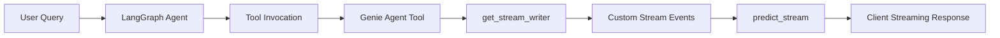

# Streaming Tool Calls and Intermediate Results in LangGraph with Databricks ResponseAgent

## ✅ IMPORTANT: Your Implementation is Already Correct!

After thorough research of Databricks/MLflow documentation, **your current synchronous implementation follows official best practices**:

- ✅ Synchronous `predict_stream` with `Generator[ResponsesAgentStreamEvent, None, None]`
- ✅ Using `app.stream()` (not `app.astream()`) for LangGraph
- ✅ Multi-mode streaming: `["updates", "messages", "custom"]`

**All official MLflow/Databricks examples use synchronous patterns.** No async conversion needed!

## Current Implementation Status

Your `[Super_Agent_hybrid.py](Notebooks/Super_Agent_hybrid.py)` already has a robust streaming foundation:

### ✅ What's Already Working

**1. Multi-Mode Streaming (Line 3821)**

```python
for event in app.stream(initial_state, run_config, stream_mode=["updates", "messages", "custom"]):
```

Three concurrent streaming modes:

- `"updates"`: State changes after each node execution
- `"messages"`: Token-by-token LLM output streaming
- `"custom"`: Agent-specific events emitted via `get_stream_writer()`

**2. Tool Call Streaming (Lines 3890-3901)**

Currently streams tool invocations when AIMessage contains tool_calls:

```python
for tool_call in msg.tool_calls:
    yield ResponsesAgentStreamEvent(
        type="response.output_item.done",
        item=self.create_function_call_item(
            id=str(uuid4()),
            call_id=tool_call.get("id"),
            name=tool_call.get("name"),
            arguments=json.dumps(tool_call.get("args", {}))
        )
    )
```

**3. Tool Result Streaming (Lines 3903-3915)**

Streams tool outputs after execution:

```python
yield ResponsesAgentStreamEvent(
    type="response.output_item.done",
    item=self.create_text_output_item(
        text=f"🔨 Tool result ({tool_name}): {tool_content}...",
        id=str(uuid4())
    )
)
```

**4. Custom Event Streaming from Nodes (Lines 2420-2435)**

All node wrappers use `get_stream_writer()` to emit progress:

```python
from langgraph.config import get_stream_writer

writer = get_stream_writer()
writer({"type": "agent_start", "agent": "unified_intent_context_clarification", "query": current_query})
```

Nodes using this pattern:

- `unified_intent_context_clarification_node` (Line 2422)
- `planning_node` (Line 2687)
- `sql_synthesis_table_route_node` (Line 2792)
- `sql_synthesis_genie_route_node` (Line 2904)
- `sql_execution_node` (Line 3040)
- `result_summarize_node` (Line 3111)

## ❌ What's Missing: Tool-Internal Streaming

Your tools (Genie agents, parallel execution tool) execute as black boxes. When a tool runs, no intermediate progress is streamed until completion.

### Current Tool Implementation (Lines 1247-1269)

```python
def _genie_tool_call(question: str, conversation_id: Optional[str] = None):
    result = agent.invoke({
        "messages": [{"role": "user", "content": question}],
        "conversation_id": conversation_id,
    })
    # Process results...
    return out
```

**Issue**: Long-running Genie agent queries show no progress during execution.

## 🎯 Enhancement Strategy: Stream from Within Tools

### Architecture Overview




### Implementation Pattern

LangGraph provides two streaming approaches for tools:

**Option 1: Custom Data Streaming** (Recommended for progress updates)

Use `stream_mode="custom"` with `get_stream_writer()`:

```python
from langgraph.config import get_stream_writer
from langchain_core.tools import tool

@tool
def genie_agent_tool(question: str, config: RunnableConfig) -> str:
    """Query Genie agent with streaming progress updates."""
    writer = get_stream_writer()
    
    # Emit start event
    writer({"type": "tool_progress", "tool": "genie_agent", "status": "started", "question": question})
    
    # If invoking sub-agent, capture intermediate results
    result = agent.invoke({
        "messages": [{"role": "user", "content": question}]
    })
    
    # Stream SQL generation progress
    if "sql" in result:
        writer({"type": "tool_progress", "tool": "genie_agent", "status": "sql_generated", "sql": result["sql"][:200]})
    
    # Stream execution progress
    writer({"type": "tool_progress", "tool": "genie_agent", "status": "executing"})
    
    # Emit completion
    writer({"type": "tool_progress", "tool": "genie_agent", "status": "completed"})
    
    return result
```

**Option 2: LLM Token Streaming** (For tools calling LLMs)

Use `stream_mode="messages"` to stream LLM tokens from within tools. **Note**: Keep tools synchronous per Databricks recommendations.

```python
@tool
def genie_agent_tool(question: str, config: RunnableConfig) -> str:
    """Tool with LLM token streaming (synchronous)."""
    # Use synchronous invoke with streaming callbacks
    # The streaming happens via LangGraph's stream_mode="messages"
    response = llm.invoke(
        [{"role": "user", "content": question}],
        config  # Pass config for streaming context propagation
    )
    return response.content
```

**Important**: According to MLflow/Databricks documentation, ResponsesAgent should use synchronous generators, not async. All official examples demonstrate synchronous patterns.

## 📋 Specific Enhancements for Your Implementation

### Enhancement 1: Streaming Genie Agent Tools

**Location**: `[Super_Agent_hybrid.py](Notebooks/Super_Agent_hybrid.py)`, Line 1247-1270

**Current Code**:

```python
def _genie_tool_call(question: str, conversation_id: Optional[str] = None):
    result = agent.invoke({
        "messages": [{"role": "user", "content": question}],
        "conversation_id": conversation_id,
    })
    # Extract and return results
```

**Enhanced Version**:

```python
def _genie_tool_call_streaming(question: str, conversation_id: Optional[str] = None, config: RunnableConfig = None):
    """Streaming Genie tool with progress updates."""
    from langgraph.config import get_stream_writer
    
    writer = get_stream_writer()
    
    # Emit start
    writer({
        "type": "genie_progress",
        "agent": agent.space_id,
        "status": "invoked",
        "question": question[:100]
    })
    
    try:
        # Invoke Genie agent (could be enhanced to stream internally)
        result = agent.invoke({
            "messages": [{"role": "user", "content": question}],
            "conversation_id": conversation_id,
        }, config=config if config else {})
        
        # Extract outputs
        out = {"conversation_id": result.get("conversation_id")}
        msgs = result["messages"]
        
        # Stream SQL as soon as generated
        sql = next((getattr(m, "content", "") for m in msgs if getattr(m, "name", None) == "query_sql"), None)
        if sql:
            writer({
                "type": "genie_progress",
                "agent": agent.space_id,
                "status": "sql_generated",
                "sql_preview": sql[:300]
            })
            out["sql"] = sql
        
        # Stream reasoning
        reasoning = next((getattr(m, "content", "") for m in msgs if getattr(m, "name", None) == "query_reasoning"), None)
        if reasoning:
            writer({
                "type": "genie_progress",
                "agent": agent.space_id,
                "status": "reasoning_complete"
            })
            out["reasoning"] = reasoning
        
        # Stream final answer
        answer = next((getattr(m, "content", "") for m in msgs if getattr(m, "name", None) == "query_result"), None) or ""
        out["answer"] = answer
        
        writer({
            "type": "genie_progress",
            "agent": agent.space_id,
            "status": "completed",
            "result_size": len(answer)
        })
        
        return out
        
    except Exception as e:
        writer({
            "type": "genie_progress",
            "agent": agent.space_id,
            "status": "failed",
            "error": str(e)
        })
        raise
```

**Key Changes**:

1. Import `get_stream_writer` at function level
2. Add `config: RunnableConfig` parameter to tool signature
3. Emit progress events at each stage
4. Pass config to sub-agent invocations
5. Stream SQL/reasoning as soon as available

**Update StructuredTool Definition** (Line 1273):

```python
genie_tool = StructuredTool(
    name=genie_agent_name,
    description=(...),
    args_schema=GenieToolInput,
    func=make_genie_tool_call_streaming(genie_agent),  # Use streaming version
)
```

### Enhancement 2: Streaming Parallel Execution Tool

**Location**: Line 1381-1432

For parallel tool execution, stream each agent's progress independently:

```python
def invoke_parallel_genie_agents_streaming(genie_route_plan: Dict[str, str], config: RunnableConfig = None) -> Dict[str, Any]:
    """Parallel invocation with per-agent streaming."""
    from langgraph.config import get_stream_writer
    
    writer = get_stream_writer()
    
    # Emit start event
    writer({
        "type": "parallel_execution",
        "status": "started",
        "agent_count": len(genie_route_plan)
    })
    
    # Build parallel execution map
    parallel_map = {}
    for space_id, question in genie_route_plan.items():
        # Find matching tool
        tool = next((t for t in self.genie_agent_tools if t.name.endswith(space_id[-8:])), None)
        if tool:
            parallel_map[space_id] = RunnableLambda(lambda q, sid=space_id: (
                writer({"type": "parallel_execution", "status": "invoking", "space_id": sid}),
                tool.func(q)
            )[1])  # Execute writer + func, return func result
    
    # Execute in parallel
    parallel_runnable = RunnableParallel(**parallel_map)
    results = parallel_runnable.invoke({k: v for k, v in genie_route_plan.items()}, config=config or {})
    
    # Emit completion
    writer({
        "type": "parallel_execution",
        "status": "completed",
        "results_count": len(results)
    })
    
    return merge_genie_outputs(results)
```

### Enhancement 3: Custom Event Formatting

**Location**: Line 3920-3933

Your `predict_stream` already handles custom events. Enhance the formatter for richer tool progress:

```python
def format_custom_event(self, custom_data: Any) -> str:
    """Format custom streaming events with tool-specific formatting."""
    if isinstance(custom_data, dict):
        event_type = custom_data.get("type", "unknown")
        
        # Tool progress events
        if event_type == "genie_progress":
            agent = custom_data.get("agent", "unknown")
            status = custom_data.get("status", "")
            
            if status == "invoked":
                return f"🔧 Invoking Genie agent: {agent}"
            elif status == "sql_generated":
                sql_preview = custom_data.get("sql_preview", "")
                return f"📝 SQL generated by {agent}:\n```sql\n{sql_preview}\n```"
            elif status == "reasoning_complete":
                return f"💭 Reasoning complete for {agent}"
            elif status == "completed":
                result_size = custom_data.get("result_size", 0)
                return f"✅ {agent} completed ({result_size} chars)"
            elif status == "failed":
                error = custom_data.get("error", "Unknown error")
                return f"❌ {agent} failed: {error}"
        
        # Parallel execution events
        elif event_type == "parallel_execution":
            status = custom_data.get("status", "")
            if status == "started":
                count = custom_data.get("agent_count", 0)
                return f"⚡ Starting parallel execution of {count} agents"
            elif status == "invoking":
                space_id = custom_data.get("space_id", "")
                return f"⚡ Invoking agent: {space_id[-8:]}"
            elif status == "completed":
                count = custom_data.get("results_count", 0)
                return f"✅ Parallel execution complete ({count} results)"
        
        # Agent-level events (existing)
        elif event_type == "agent_start":
            agent = custom_data.get("agent", "unknown")
            return f"🎯 Starting: {agent}"
        
        # Generic formatting fallback
        return f"📊 {event_type}: {json.dumps(custom_data, indent=2)}"
    
    return str(custom_data)
```

## 📚 Key LangGraph Streaming Concepts

### Stream Modes Reference


| Mode         | Purpose                | When to Use                                   |
| ------------ | ---------------------- | --------------------------------------------- |
| `"updates"`  | State changes per node | Track workflow progress, routing decisions    |
| `"messages"` | LLM token streaming    | Real-time LLM output, tool-internal LLM calls |
| `"custom"`   | Arbitrary data         | Tool progress, metadata, custom notifications |
| `"values"`   | Full state snapshots   | Debugging, complete state inspection          |
| `"debug"`    | Internal operations    | Development troubleshooting                   |


### get_stream_writer() Rules

1. **Scope**: Only callable inside StateGraph nodes or functional API tasks
2. **Thread-safe**: Can be called from any node execution context
3. **Data format**: Accepts any JSON-serializable data
4. **Multiple calls**: Can emit multiple events per execution
5. **Config propagation**: Tools must accept `RunnableConfig` parameter to access writer

### ResponsesAgent Integration

Your `predict_stream` method correctly:

- Uses `app.stream()` with multiple modes
- Converts events to `ResponsesAgentStreamEvent`
- Handles tool calls via `create_function_call_item()`
- Streams text deltas via `create_text_delta()`
- Processes custom events through `format_custom_event()`

## 🔄 Migration Path

### Phase 1: Add Config Parameters

- Update all tool signatures to accept `config: RunnableConfig = None`
- Update `GenieToolInput` and `ParallelGenieInput` schemas if needed

### Phase 2: Inject get_stream_writer

- Add streaming logic to `_genie_tool_call` 
- Add streaming logic to `invoke_parallel_genie_agents`
- Test custom events appear in `predict_stream`

### Phase 3: Enhance Formatting

- Update `format_custom_event()` with tool-specific formatting
- Add emojis/structure for better UX in Playground

### ❌ Phase 4: Async Optimization - NOT RECOMMENDED

**IMPORTANT**: After reviewing Databricks/MLflow documentation, **async tools are NOT recommended** for ResponsesAgent:

- All official MLflow examples use synchronous `Generator[ResponsesAgentStreamEvent, None, None]`
- The official LangGraph wrapping example uses `agent.stream()` (sync), NOT `agent.astream()` (async)
- ResponsesAgent's `predict_stream` method signature is designed for synchronous generators
- Your current implementation already follows best practices

**Why not async?**

- Databricks Model Serving handles concurrency at the serving layer, not the agent layer
- Adding async adds complexity without performance benefits
- Synchronous streaming with `get_stream_writer()` is the documented pattern
- Agent Server supports async FastAPI infrastructure, but agents themselves remain sync

## 📖 Reference Documentation

### Databricks/MLflow Resources (Official Recommendations)

- [ResponsesAgent for Model Serving](https://mlflow.org/docs/latest/genai/serving/responses-agent/)
- [ResponsesAgent Introduction](https://mlflow.org/docs/latest/genai/flavors/responses-agent-intro/)
- [MLflow Agent Server](https://mlflow.org/docs/latest/genai/serving/agent-server/)
- [Author AI agents in code (Databricks)](https://docs.databricks.com/aws/en/generative-ai/agent-framework/author-agent)

**Key Finding**: All official examples use **synchronous** `Generator[ResponsesAgentStreamEvent, None, None]`, not async generators.

### LangGraph Resources

- [LangGraph Streaming Overview](https://langchain-ai.github.io/langgraph/how-tos/streaming/)
- [Streaming from Within Tools](https://langchain-ai.github.io/langgraph/how-tos/streaming-events-from-within-tools/)
- [LangGraph Stream Modes API](https://docs.langchain.com/langgraph-platform/streaming)

### Context7 Documentation

- LangGraph: `/langchain-ai/langgraph`
- LangChain Core: `/websites/langchain_oss_python`
- MLflow: `/mlflow/mlflow`

### Code Examples from Research

**Streaming Custom Data from Tool**:

```python
from langgraph.config import get_stream_writer

@tool
async def get_items(place: str) -> str:
    """Use this tool to list items one might find in a place."""
    writer = get_stream_writer()
    
    items = ["books", "pencils", "pictures"]
    for chunk in items:
        writer({"custom_tool_data": chunk})
    
    return ", ".join(items)
```

**Streaming LLM Tokens from Tool**:

```python
@tool
async def get_items(place: str, config: RunnableConfig) -> str:
    """Tool that streams LLM tokens during execution."""
    # CRITICAL: Pass config for streaming propagation
    response = await llm.ainvoke(
        [{"role": "user", "content": f"Items in {place}"}],
        config  # Required!
    )
    return response.content
```

## ⚡ Performance Considerations

1. **Streaming Overhead**: Each `writer()` call adds network latency (typically 10-50ms)
2. **Event Frequency**: Emit events at meaningful milestones, not every loop iteration
3. **Payload Size**: Keep custom event data < 1KB for optimal streaming
4. **Synchronous Pattern**: Per Databricks/MLflow best practices, use synchronous generators for ResponsesAgent
5. **Concurrency Handling**: Databricks Model Serving handles concurrent requests at the infrastructure layer
6. **Timeout Configuration**: For long-running agents, configure `MLFLOW_DEPLOYMENT_PREDICT_TIMEOUT` (default: 120s) and `MLFLOW_DEPLOYMENT_PREDICT_TOTAL_TIMEOUT` (default: 600s)

## 🧪 Testing Streaming

**Test streaming locally**:

```python
# Test with custom stream mode
for event in AGENT.predict_stream(request):
    if event.type == "response.output_item.done":
        item = event.item
        if hasattr(item, 'text') and 'genie_progress' in item.text:
            print(f"Tool progress: {item.text}")
```

**Test in Databricks Playground**:

- Deploy agent to Model Serving
- Use Playground with streaming enabled
- Observe real-time tool progress updates

## Summary

Your implementation already has excellent streaming infrastructure and follows Databricks/MLflow best practices:

✅ **Already Correct**:

- Uses synchronous `predict_stream` with `Generator[ResponsesAgentStreamEvent, None, None]`
- Uses `app.stream()` (sync) not `app.astream()` (async) for LangGraph
- Streams with multiple modes: `["updates", "messages", "custom"]`
- Properly handles tool calls and tool results in streaming

🎯 **Key Enhancement**:

Add `get_stream_writer()` calls **inside your tools** to stream intermediate progress during long-running operations like Genie agent invocations. This transforms tools from black boxes into transparent, progress-reporting operations that significantly improve user experience.

❌ **What NOT to Do**:

- Do NOT convert to async tools (not recommended by Databricks/MLflow)
- Do NOT use `async def` / `await` in tool implementations
- Do NOT use `app.astream()` (current sync approach is correct)

Your current synchronous streaming pattern aligns perfectly with official Databricks/MLflow documentation and examples.