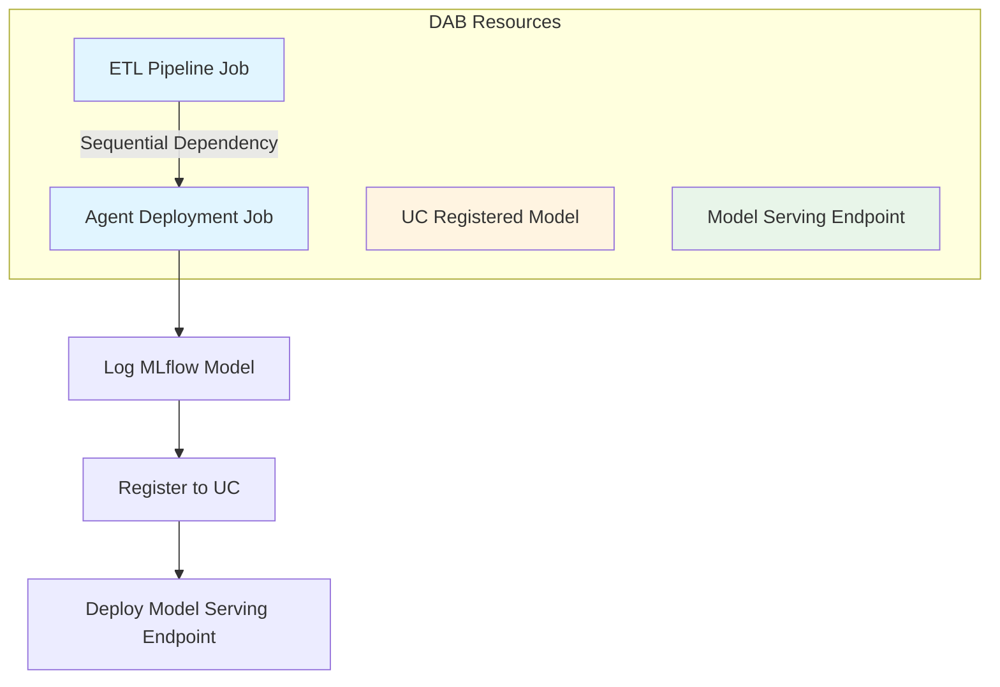

# Deploy Agent System with Databricks Asset Bundles

## Overview

Integrate the multi-agent system deployment into the existing DAB configuration, creating a unified deployment workflow where:

1. ETL pipeline runs first (export → enrich → build vector index)
2. Agent deployment job runs second (log model → register to UC → deploy endpoint)
3. Both support dev/prod environments with appropriate configurations

## Architecture




## Implementation Approach

### Option 1: Job-Based Deployment (Recommended)

Add a job resource that runs `[Notebooks/deploy_agent.py](Notebooks/deploy_agent.py)`, which handles the complete deployment workflow. This is the simplest approach and mirrors your existing ETL pattern.

**Pros:**

- Follows same pattern as ETL pipeline (consistent)
- Handles entire workflow (log → register → deploy) atomically
- Easy to track deployment history via job runs
- Works with existing deploy_agent.py without modifications

**Cons:**

- Not fully declarative (endpoint created by notebook code, not DAB resource definition)

### Option 2: Hybrid Native Resources (More Complex)

Split deployment into:

1. Job to log and register model to UC
2. Native `model_serving_endpoints` resource in DAB that references the UC model
3. Native `registered_models` resource to track the UC model

**Pros:**

- Fully declarative endpoint configuration in YAML
- Better visibility of endpoint config in bundle
- Endpoint managed directly by DAB

**Cons:**

- Requires refactoring deploy_agent.py into multiple notebooks
- More complex dependency chain
- Potential conflicts if both DAB and agents.deploy() try to manage endpoint

**Recommendation:** Use Option 1 for simplicity and consistency with your ETL pattern.

## Changes Required

### 1. Update `[databricks.yml](databricks.yml)`

Add new variables for agent deployment configuration:

```yaml
variables:
  # ... existing ETL variables ...
  
  # Agent Deployment Configuration
  agent_model_name:
    description: UC model name for deployed agent
    default: super_agent_hybrid
  agent_endpoint_name:
    description: Model serving endpoint name
    default: multi-agent-genie-endpoint
  agent_workload_size:
    description: Model serving workload size
    default: Small
  lakebase_instance:
    description: Lakebase instance for agent state
    default: multi-agent-genie-system-state-db
  sql_warehouse_id:
    description: SQL Warehouse ID for Genie spaces
    default: a4ed2ccbda385db9
```

Add agent deployment job in `resources.jobs`:

```yaml
resources:
  jobs:
    # ... existing etl_pipeline job ...
    
    agent_deployment:
      name: multi_agent_genie_deployment
      description: >-
        Deploy multi-agent system to Model Serving. Logs MLflow model,
        registers to Unity Catalog, and deploys serving endpoint.
        Depends on ETL pipeline for vector search index and metadata.
      max_concurrent_runs: 1
      tags:
        project: multi_agent_genie
        component: agent_deployment
      
      tasks:
        - task_key: deploy_agent
          depends_on:
            - task_key: etl_pipeline
              job_id: ${resources.jobs.etl_pipeline.id}
          notebook_task:
            notebook_path: ./Notebooks/deploy_agent.py
            source: WORKSPACE
          timeout_seconds: 3600
          
          # Use serverless compute (no cluster needed)
          # Note: Model deployment itself happens via Model Serving,
          # this task just orchestrates the deployment
```

Update target configurations:

```yaml
targets:
  dev:
    mode: development
    default: true
    workspace:
      host: https://adb-984752964297111.11.azuredatabricks.net
    variables:
      # ETL variables remain unchanged
      # Agent-specific overrides for dev
      agent_model_name: super_agent_hybrid_dev
      agent_endpoint_name: multi-agent-genie-endpoint-dev
      lakebase_instance: multi-agent-genie-state-dev
  
  prod:
    workspace:
      host: https://fevm-serverless-dbx-unifiedchat.cloud.databricks.com
    variables:
      # ETL prod overrides...
      # Agent prod overrides
      agent_model_name: super_agent_hybrid
      agent_endpoint_name: multi-agent-genie-endpoint
      lakebase_instance: multi-agent-genie-system-state-db
      sql_warehouse_id: a4ed2ccbda385db9
```

### 2. Update `[Notebooks/deploy_agent.py](Notebooks/deploy_agent.py)`

Modify to accept parameters from DAB and use environment-specific naming:

**Add parameter cell at the top:**

```python
# COMMAND ----------
# DBTITLE 1,Widget Parameters (for DAB integration)
dbutils.widgets.text("catalog_name", "", "Catalog Name")
dbutils.widgets.text("schema_name", "", "Schema Name")
dbutils.widgets.text("agent_model_name", "super_agent_hybrid", "Agent Model Name")
dbutils.widgets.text("agent_endpoint_name", "", "Agent Endpoint Name")
dbutils.widgets.text("lakebase_instance", "", "Lakebase Instance")
dbutils.widgets.text("sql_warehouse_id", "", "SQL Warehouse ID")
dbutils.widgets.text("bundle_target", "dev", "Bundle Target (dev/prod)")

# Get parameters (fallback to prod_config.yaml if not provided)
CATALOG = dbutils.widgets.get("catalog_name") or yaml_config['catalog_name']
SCHEMA = dbutils.widgets.get("schema_name") or yaml_config['schema_name']
AGENT_MODEL_NAME = dbutils.widgets.get("agent_model_name") or "super_agent_hybrid"
LAKEBASE_INSTANCE = dbutils.widgets.get("lakebase_instance") or yaml_config['lakebase_instance_name']
SQL_WAREHOUSE_ID = dbutils.widgets.get("sql_warehouse_id") or yaml_config['sql_warehouse_id']
BUNDLE_TARGET = dbutils.widgets.get("bundle_target")
```

**Update model registration to use environment-specific names:**

```python
# Register to Unity Catalog with environment-specific name
UC_MODEL_NAME = f"{CATALOG}.{SCHEMA}.{AGENT_MODEL_NAME}"
```

### 3. Update Config Files

Ensure `[prod_config.yaml](prod_config.yaml)` and `dev_config.yaml` have consistent structure and reference the same variables as DAB.

### 4. Add Dependency Configuration

The key change is making the agent deployment job depend on the ETL pipeline job completion. This is done via `depends_on` with `job_id` reference.

**Important:** DAB cross-job dependencies require the downstream task to reference the upstream job by ID using the `${resources.jobs.<job_key>.id}` syntax.

## Deployment Workflow

### Deploy Both Pipelines

```bash
# Deploy to dev (default)
databricks bundle deploy

# Deploy to prod
databricks bundle deploy -t prod
```

### Run ETL + Agent Deployment Sequentially

```bash
# Run ETL pipeline first
databricks bundle run etl_pipeline

# Agent deployment runs automatically after ETL completes
# OR trigger manually:
databricks bundle run agent_deployment
```

### Run Only Agent Deployment (After ETL Exists)

```bash
databricks bundle run agent_deployment -t prod
```

## Validation Steps

1. **Validate bundle syntax:**

```bash
   databricks bundle validate
   databricks bundle validate -t prod
   

```

1. **Check deployed resources after deployment:**

```bash
   databricks workspace list /Workspace/.bundle
   

```

1. **Verify ETL job:**

```bash
   databricks jobs list --output json | jq '.jobs[] | select(.settings.name | contains("multi_agent_genie_etl"))'
   

```

1. **Verify agent deployment job:**

```bash
   databricks jobs list --output json | jq '.jobs[] | select(.settings.name | contains("multi_agent_genie_deployment"))'
   

```

1. **Check model serving endpoint:**

```bash
   databricks serving-endpoints get multi-agent-genie-endpoint-dev
   

```

## Environment-Specific Configurations

### Dev Environment

- Catalog: `yyang`
- Model name: `super_agent_hybrid_dev`
- Endpoint: `multi-agent-genie-endpoint-dev`
- Lakebase: `multi-agent-genie-state-dev`

### Prod Environment

- Catalog: `serverless_dbx_unifiedchat_catalog`
- Model name: `super_agent_hybrid`
- Endpoint: `multi-agent-genie-endpoint`
- Lakebase: `multi-agent-genie-system-state-db`

## Benefits of This Approach

1. **Unified Deployment:** Single `databricks bundle deploy` handles all resources
2. **Dependency Management:** Agent deployment only runs after ETL completes successfully
3. **Environment Consistency:** Same code deploys to dev/prod with different configs
4. **Version Control:** All deployment config in Git via databricks.yml
5. **Auditability:** Job run history tracks when models were deployed
6. **Rollback:** Can re-run previous versions via job history

## Testing Strategy

1. **Deploy to dev first:**

```bash
   databricks bundle deploy
   databricks bundle run etl_pipeline
   

```

1. **Verify ETL completes successfully**
2. **Verify agent deployment starts automatically**
3. **Test deployed endpoint:**

```python
   from databricks.sdk import WorkspaceClient
   w = WorkspaceClient()
   response = w.serving_endpoints.query(
       name="multi-agent-genie-endpoint-dev",
       inputs=[{
           "input": [{"role": "user", "content": "Show me patient data"}],
           "custom_inputs": {"thread_id": "test-123"}
       }]
   )
   

```

1. **Once validated, deploy to prod:**

```bash
   databricks bundle deploy -t prod
   databricks bundle run etl_pipeline -t prod
   

```

## Alternative: Native Model Serving Endpoint Resource

If you prefer a fully declarative approach (not recommended due to complexity), you can split the deployment:

**Add to resources:**

```yaml
resources:
  registered_models:
    agent_model:
      name: ${var.catalog_name}.${var.schema_name}.${var.agent_model_name}
      comment: "Multi-agent system with memory and Genie integration"
      tags:
        - key: "project"
          value: "multi_agent_genie"
  
  model_serving_endpoints:
    agent_endpoint:
      name: ${var.agent_endpoint_name}
      config:
        served_entities:
          - name: current
            entity_name: ${var.catalog_name}.${var.schema_name}.${var.agent_model_name}
            entity_version: "1"  # Or use latest
            workload_size: ${var.agent_workload_size}
            scale_to_zero_enabled: true
      route_optimized: true
```

This approach requires:

1. Separate job to log/register model (modified deploy_agent.py)
2. Manual version management
3. More complex dependency tracking

## Files to Modify

- `[databricks.yml](databricks.yml)` - Add agent deployment job and variables
- `[Notebooks/deploy_agent.py](Notebooks/deploy_agent.py)` - Add widget parameters
- `[dev_config.yaml](dev_config.yaml)` - Ensure consistency with dev target (optional)
- `[prod_config.yaml](prod_config.yaml)` - Ensure consistency with prod target (optional)

## Risks and Mitigation


| Risk                                                    | Mitigation                                                        |
| ------------------------------------------------------- | ----------------------------------------------------------------- |
| ETL fails, agent deployment still runs                  | Dependency ensures agent only runs after ETL success              |
| Endpoint already exists from previous manual deployment | deploy_agent.py handles updates via agents.deploy()               |
| Different configs in YAML vs deploy_agent.py            | Pass all config via widgets, use YAML as source of truth          |
| Model serving endpoint takes long to deploy             | Job timeout set to 3600s (1 hour), monitor via Model Serving UI   |
| Lakebase instance doesn't exist                         | Pre-create Lakebase instances in dev/prod before first deployment |


## Success Criteria

✅ `databricks bundle deploy` succeeds for both dev and prod
✅ ETL pipeline runs successfully and creates vector search index
✅ Agent deployment job starts after ETL completes
✅ Model is logged to MLflow with proper resources
✅ Model is registered to UC with environment-specific name
✅ Model Serving endpoint is created and reaches READY state
✅ Test query to endpoint returns successful response
✅ Deployment can be repeated for updates (idempotent)