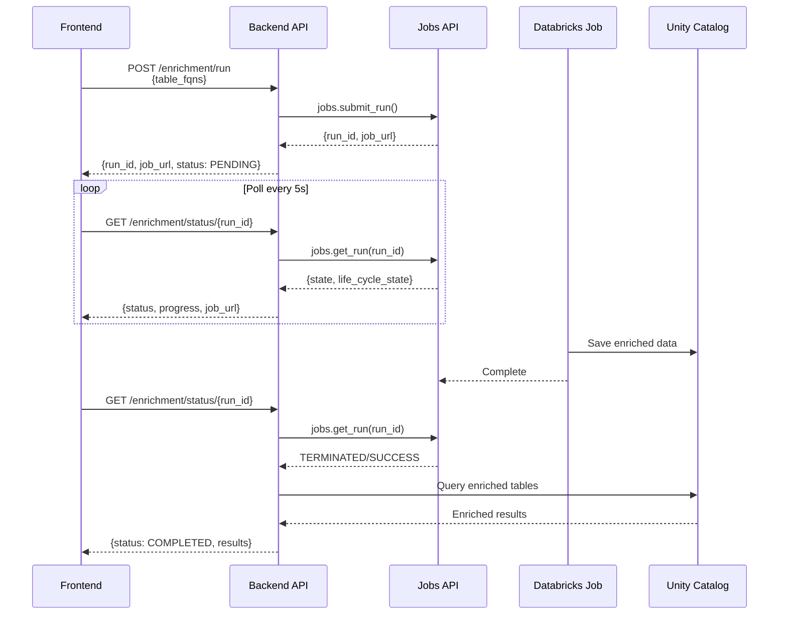

# Backend Integration: Databricks Job Submission (Phase 2)

## Overview

Replace inline enrichment processing in `router.py` with Databricks Jobs API integration. Frontend will track job execution via URL and status polling.

## Architecture




## Files to Modify

### 1. Backend Models (`models.py`)

**Add new models:**

```python
# Job-related models
class EnrichmentJobStatus(str, Enum):
    PENDING = "pending"
    RUNNING = "running"  
    COMPLETED = "completed"
    FAILED = "failed"
    CANCELLED = "cancelled"

class EnrichmentJobOut(BaseModel):
    """Response when submitting enrichment job."""
    run_id: int
    job_url: str
    status: EnrichmentJobStatus
    table_count: int
    submitted_at: str

class EnrichmentJobStatusOut(BaseModel):
    """Job status response."""
    run_id: int
    status: EnrichmentJobStatus
    job_url: str
    life_cycle_state: Optional[str] = None  # PENDING, RUNNING, TERMINATING, TERMINATED
    result_state: Optional[str] = None  # SUCCESS, FAILED, CANCELLED
    state_message: Optional[str] = None
    start_time: Optional[int] = None
    end_time: Optional[int] = None
    duration_ms: Optional[int] = None

# Keep existing EnrichmentResultOut for results
```

**Update existing EnrichmentStatus enum** to align with job states.

### 2. Backend Router (`router.py`)

**Replace lines 118-238** (current inline enrichment) with job submission:

```python
from databricks.sdk import WorkspaceClient
from databricks.sdk.service.jobs import RunSubmitTaskSettings, Source, NotebookTask

# Initialize Databricks client
w = WorkspaceClient()

# Configuration
ENRICHMENT_JOB_CLUSTER_SPEC = {
    "spark_version": "15.4.x-scala2.12",
    "node_type_id": "i3.xlarge",
    "num_workers": 2,
    "spark_conf": {
        "spark.databricks.cluster.profile": "serverless"
    }
}

ENRICHMENT_SCRIPT_PATH = "/Workspace/Repos/production/tables_to_genies/etl/enrich_tables_direct.py"

@api.post("/enrichment/run", response_model=EnrichmentJobOut, operation_id="runEnrichment")
async def run_enrichment(enrichment_in: EnrichmentRunIn):
    """Submit Databricks job for table enrichment."""
    
    # Prepare parameters
    table_fqns_str = ','.join(enrichment_in.table_fqns)
    sample_size = "20"
    max_unique_values = "50"
    llm_endpoint = "databricks-claude-sonnet-4-5"
    
    # Submit job
    run_result = w.jobs.submit(
        run_name=f"Table Enrichment - {len(enrichment_in.table_fqns)} tables",
        tasks=[
            RunSubmitTaskSettings(
                task_key="enrich_tables",
                notebook_task=NotebookTask(
                    notebook_path=ENRICHMENT_SCRIPT_PATH,
                    source=Source.WORKSPACE,
                    base_parameters={
                        "table_fqns": table_fqns_str,
                        "sample_size": sample_size,
                        "max_unique_values": max_unique_values,
                        "llm_endpoint": llm_endpoint
                    }
                ),
                new_cluster=ENRICHMENT_JOB_CLUSTER_SPEC
            )
        ]
    )
    
    # Get job URL
    job_url = f"{config.host}/#job/{run_result.run_id}"
    
    return EnrichmentJobOut(
        run_id=run_result.run_id,
        job_url=job_url,
        status=EnrichmentJobStatus.PENDING,
        table_count=len(enrichment_in.table_fqns),
        submitted_at=datetime.now().isoformat()
    )


@api.get("/enrichment/status/{run_id}", response_model=EnrichmentJobStatusOut, operation_id="getEnrichmentStatus")
async def get_enrichment_status(run_id: int):
    """Get Databricks job status."""
    
    try:
        run = w.jobs.get_run(run_id=run_id)
    except Exception as e:
        raise HTTPException(status_code=404, detail=f"Job run not found: {str(e)}")
    
    # Map Databricks states to our status
    life_cycle_state = run.state.life_cycle_state.value if run.state.life_cycle_state else None
    result_state = run.state.result_state.value if run.state.result_state else None
    
    status = EnrichmentJobStatus.PENDING
    if life_cycle_state == "RUNNING":
        status = EnrichmentJobStatus.RUNNING
    elif life_cycle_state == "TERMINATED":
        if result_state == "SUCCESS":
            status = EnrichmentJobStatus.COMPLETED
        elif result_state == "FAILED":
            status = EnrichmentJobStatus.FAILED
        elif result_state == "CANCELED":
            status = EnrichmentJobStatus.CANCELLED
    
    job_url = f"{config.host}/#job/{run_id}"
    
    return EnrichmentJobStatusOut(
        run_id=run_id,
        status=status,
        job_url=job_url,
        life_cycle_state=life_cycle_state,
        result_state=result_state,
        state_message=run.state.state_message,
        start_time=run.start_time,
        end_time=run.end_time,
        duration_ms=(run.end_time - run.start_time) if run.end_time and run.start_time else None
    )


@api.get("/enrichment/results", response_model=List[EnrichmentResultListOut], operation_id="listEnrichmentResults")
async def list_enrichment_results():
    """List enriched tables from Unity Catalog."""
    
    try:
        # Query enriched results from UC table
        conn = sql.connect(
            server_hostname=config.host,
            http_path=f"/sql/1.0/warehouses/{warehouse_id}",
            credentials_provider=lambda: config.authenticate,
        )
        
        cursor = conn.cursor()
        cursor.execute("""
            SELECT table_fqn, enriched_doc 
            FROM yyang.multi_agent_genie.enriched_tables_direct 
            WHERE enriched = true
            ORDER BY id DESC
            LIMIT 100
        """)
        
        results = []
        for row in cursor.fetchall():
            table_fqn = row[0]
            enriched_doc = json.loads(row[1])
            
            results.append(EnrichmentResultListOut(
                fqn=table_fqn,
                column_count=enriched_doc.get('total_columns', 0),
                enriched=enriched_doc.get('enriched', False)
            ))
        
        cursor.close()
        conn.close()
        
        return results
        
    except Exception as e:
        print(f"Error fetching enrichment results: {e}")
        return []


@api.get("/enrichment/results/{fqn:path}", response_model=EnrichmentResultOut, operation_id="getEnrichmentResult")
async def get_enrichment_result(fqn: str):
    """Get enrichment result for specific table from Unity Catalog."""
    
    try:
        conn = sql.connect(
            server_hostname=config.host,
            http_path=f"/sql/1.0/warehouses/{warehouse_id}",
            credentials_provider=lambda: config.authenticate,
        )
        
        cursor = conn.cursor()
        cursor.execute(
            "SELECT enriched_doc FROM yyang.multi_agent_genie.enriched_tables_direct WHERE table_fqn = ?",
            (fqn,)
        )
        
        row = cursor.fetchone()
        cursor.close()
        conn.close()
        
        if not row:
            raise HTTPException(status_code=404, detail=f"Table {fqn} not found")
        
        enriched_doc = json.loads(row[0])
        
        # Convert to response model
        return EnrichmentResultOut(
            fqn=enriched_doc['table_fqn'],
            catalog=enriched_doc['catalog'],
            schema=enriched_doc['schema'],
            table=enriched_doc['table'],
            column_count=enriched_doc['total_columns'],
            columns=[
                ColumnEnriched(
                    name=col['column_name'],
                    type=col['data_type'],
                    comment=col.get('enhanced_comment', col.get('comment', '')),
                    sample_values=col.get('sample_values', [])
                )
                for col in enriched_doc['enriched_columns'][:10]
            ],
            enriched=enriched_doc['enriched'],
            timestamp=enriched_doc['enrichment_timestamp']
        )
        
    except HTTPException:
        raise
    except Exception as e:
        raise HTTPException(status_code=500, detail=f"Error fetching result: {str(e)}")
```

### 3. Frontend Updates

**Update `enrichment.tsx` (lines 27-32):**

```typescript
const handleRunEnrichment = async () => {
  const result = await runEnrichmentMutation.mutateAsync({
    table_fqns: selection.table_fqns,
  });
  // result now contains: {run_id, job_url, status}
  setJobId(result.run_id.toString());
  setJobUrl(result.job_url);  // Add state for job URL
};
```

**Update EnrichmentProgress component (lines 84-111):**

```typescript
function EnrichmentProgress({ jobId, jobUrl }: { jobId: string, jobUrl: string }) {
  const { data: status } = useGetEnrichmentStatusSuspense(parseInt(jobId), selector());

  return (
    <Card>
      <CardHeader>
        <CardTitle className="flex items-center justify-between">
          <span>Enrichment Progress</span>
          <a 
            href={jobUrl} 
            target="_blank" 
            rel="noopener noreferrer"
            className="text-sm text-blue-600 hover:text-blue-800 flex items-center gap-1"
          >
            View Job <ExternalLink size={14} />
          </a>
        </CardTitle>
      </CardHeader>
      <CardContent>
        <div className="space-y-2">
          <div className="flex justify-between text-sm">
            <span>Status: {status.status}</span>
            <span>Run ID: {status.run_id}</span>
          </div>
          {status.life_cycle_state && (
            <div className="text-xs text-muted-foreground">
              State: {status.life_cycle_state}
              {status.result_state && ` → ${status.result_state}`}
            </div>
          )}
          {status.duration_ms && (
            <div className="text-xs text-muted-foreground">
              Duration: {(status.duration_ms / 1000).toFixed(1)}s
            </div>
          )}
          {status.state_message && (
            <p className="text-sm text-muted-foreground mt-2">{status.state_message}</p>
          )}
          {status.status === 'failed' && (
            <p className="text-sm text-destructive">Enrichment job failed. Check logs in Databricks.</p>
          )}
        </div>
      </CardContent>
    </Card>
  );
}
```

**Update polling interval** - change React Query refetch to 5 seconds for job monitoring.

### 4. OpenAPI Schema Generation

After backend changes, regenerate frontend API client:

```bash
cd tables_to_genies_apx/src/tables_genies/ui
bun run generate-api
```

## Configuration

### Environment Variables

Add to backend `.env` or `app.yaml`:

```
ENRICHMENT_SCRIPT_PATH=/Workspace/Repos/production/tables_to_genies/etl/enrich_tables_direct.py
ENRICHMENT_CLUSTER_NODE_TYPE=i3.xlarge
ENRICHMENT_NUM_WORKERS=2
```

### Script Deployment

Ensure `enrich_tables_direct.py` is deployed to Databricks workspace:

- Upload via Repos (recommended)
- Or upload directly to Workspace

## Testing Plan

1. **Backend Job Submission**
  - Test POST `/enrichment/run` with sample table FQNs
  - Verify job is created in Databricks
  - Check job URL is valid
2. **Status Polling**
  - Poll GET `/enrichment/status/{run_id}` while job runs
  - Verify status transitions: PENDING → RUNNING → COMPLETED
  - Check duration and state messages
3. **Results Retrieval**
  - After job completes, fetch from `/enrichment/results`
  - Verify enriched metadata includes LLM descriptions
  - Check chunks are created in UC table
4. **Frontend Integration**
  - Click "Run Enrichment" → job submits
  - Job URL link opens Databricks UI
  - Status updates automatically every 5s
  - Results appear when complete

## Rollback Plan

If Phase 2 has issues, inline enrichment code is preserved in git history. Can revert router.py to previous inline implementation while keeping Phase 1 module improvements.

## Success Criteria

- ✅ Jobs submit successfully via API
- ✅ Frontend displays clickable job URL
- ✅ Status polling shows real-time progress
- ✅ Results load from Unity Catalog after completion
- ✅ Error handling for failed jobs
- ✅ No breaking changes to existing API contracts

