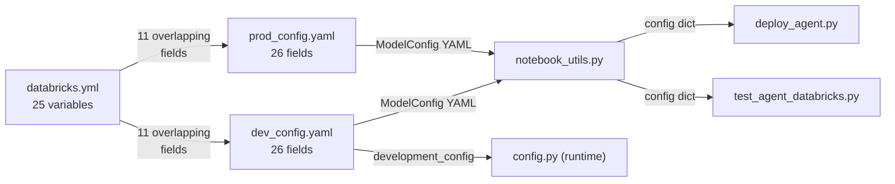
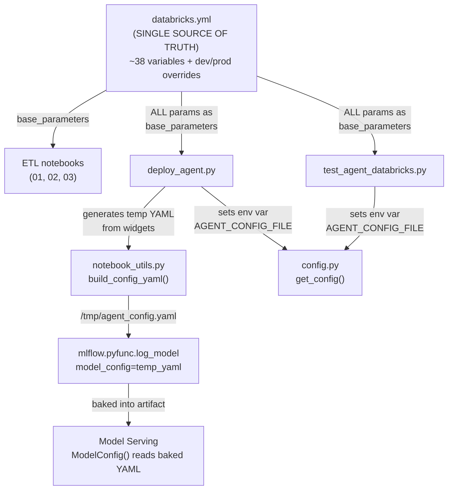

# Consolidate Configuration: databricks.yml as Single Source of Truth

## Problem

Three config sources with heavy overlap and drift risk:




- 11 fields are duplicated across all three files
- 12 fields exist ONLY in config YAMLs (not controllable via DABs)
- Any change requires editing 3 files and manually keeping them in sync

## Field-by-Field Analysis

### Overlapping fields (11) -- in BOTH databricks.yml AND config YAMLs

These are the root cause of drift. Currently must be updated in 3 places:


| Field                  | databricks.yml     | config YAML       | Risk                                           |
| ---------------------- | ------------------ | ----------------- | ---------------------------------------------- |
| `catalog_name`         | var                | field             | Already drifted (was prod value in dev_config) |
| `schema_name`          | var                | field             | Low (same in both targets)                     |
| `llm_endpoint`         | var                | field             | Low (same in both targets)                     |
| `vs_endpoint_name`     | var                | field             | Low (same in both targets)                     |
| `embedding_model`      | var                | field             | Low (same in both targets)                     |
| `genie_space_ids`      | var (comma string) | field (YAML list) | Already drifted (was prod IDs in dev_config)   |
| `sql_warehouse_id`     | var                | field             | Already drifted (was prod ID in dev_config)    |
| `sample_size`          | var                | field             | Low                                            |
| `max_unique_values`    | var                | field             | Low                                            |
| `genie_exports_volume` | var                | field             | Already drifted (was prod catalog)             |
| `enriched_docs_table`  | var                | field             | Already drifted (was prod catalog)             |


### Config-YAML-only fields (14) -- NOT in databricks.yml, need to be added

These are invisible to DABs and cannot be overridden per target today:

**Agent-specific LLM endpoints (6):**

- `llm_endpoint_clarification` (e.g., `databricks-claude-haiku-4-5`)
- `llm_endpoint_planning`
- `llm_endpoint_sql_synthesis_table`
- `llm_endpoint_sql_synthesis_genie`
- `llm_endpoint_execution`
- `llm_endpoint_summarize`

**Lakebase / state management (3):**

- `lakebase_instance_name` (e.g., `multi-agent-genie-system-state-db`)
- `lakebase_embedding_endpoint` (e.g., `databricks-gte-large-en`)
- `lakebase_embedding_dims` (e.g., `1024`)

**Model Serving (4) -- UNUSED today, hardcoded in deploy_agent.py:**

- `model_name` (e.g., `multi_agent_genie_system`) -- deploy_agent.py hardcodes `f"{CATALOG}.{SCHEMA}.super_agent_hybrid"`
- `endpoint_name` (e.g., `multi-agent-genie-endpoint`) -- deploy_agent.py uses return value from `agents.deploy()`
- `workload_size` (e.g., `Small`) -- hardcoded in `agents.deploy(workload_size="Small")`
- `scale_to_zero` (e.g., `true`) -- hardcoded in `agents.deploy(scale_to_zero=True)`

**Vector search (1) -- UNUSED today:**

- `vector_search_index` -- never read; derived in notebook_utils.py as `{catalog}.{schema}.enriched_genie_docs_chunks_vs_index`

### databricks.yml-only fields (3) -- ETL-specific, no change needed

- `volume_name` -- only used by ETL notebook `01_export_genie_spaces.py`
- `source_table` -- only used by ETL notebook `03_build_vector_search_index.py`
- `pipeline_type` -- only used by ETL notebook `03_build_vector_search_index.py`

## Unused / Dead Parameters (audit results)

### UNUSED in config YAMLs -- defined but ZERO consumers


| Field                 | File                                    | Why unused                                                                                                                                                                                                      |
| --------------------- | --------------------------------------- | --------------------------------------------------------------------------------------------------------------------------------------------------------------------------------------------------------------- |
| `vector_search_index` | dev_config.yaml:23, prod_config.yaml:23 | Never read. `notebook_utils.py` derives it as `f"{catalog}.{schema}.enriched_genie_docs_chunks_vs_index"`. Neither `model_config.get("vector_search_index")` nor `config.py` mapping references it.             |
| `model_name`          | dev_config.yaml:48, prod_config.yaml:49 | `deploy_agent.py` hardcodes `UC_MODEL_NAME = f"{CATALOG}.{SCHEMA}.super_agent_hybrid"` -- never reads from config. Only mapped in `config.py` to env var but `ModelServingConfig` is never consumed at runtime. |
| `endpoint_name`       | dev_config.yaml:49, prod_config.yaml:50 | `deploy_agent.py` uses `deployment_info.endpoint_name` from `agents.deploy()` return -- never reads from config. Same dead path through `config.py`.                                                            |
| `workload_size`       | dev_config.yaml:50, prod_config.yaml:51 | `deploy_agent.py` hardcodes `workload_size="Small"` in `agents.deploy()`. Config value ignored.                                                                                                                 |
| `scale_to_zero`       | dev_config.yaml:51, prod_config.yaml:52 | `deploy_agent.py` hardcodes `scale_to_zero=True` in `agents.deploy()`. Config value ignored.                                                                                                                    |


### UNUSED in databricks.yml -- declared but never referenced as `${var.*}`


| Variable           | Lines                          | Why unused                                                                                                                                                                                                                    |
| ------------------ | ------------------------------ | ----------------------------------------------------------------------------------------------------------------------------------------------------------------------------------------------------------------------------- |
| `sql_warehouse_id` | databricks.yml:35-37, 101, 122 | Declared as a variable and overridden per target, but NO resource YAML ever references `${var.sql_warehouse_id}`. The value reaches notebooks only through config YAML (via `config_file`), not through DABs base_parameters. |


### Orphan mapping in config.py -- key mapped but not in YAML


| Key                      | config.py line | Status                                                                                                                                                                                                                          |
| ------------------------ | -------------- | ------------------------------------------------------------------------------------------------------------------------------------------------------------------------------------------------------------------------------- |
| `vector_search_function` | Line 368       | Mapped to `VECTOR_SEARCH_FUNCTION` env var, but key does not exist in dev_config.yaml or prod_config.yaml. `model_config.get()` returns None, falls back to default in `VectorSearchConfig.from_env()`. Harmless but dead code. |


### Action: what to do with unused params

- **5 unused config YAML fields** (`vector_search_index`, `model_name`, `endpoint_name`, `workload_size`, `scale_to_zero`): Do NOT migrate to databricks.yml. Comment out in current files with `# UNUSED` marker, then delete with the YAML files.
- `**sql_warehouse_id` in databricks.yml**: Currently a dead variable. The consolidation plan will make it live by passing it as a base_parameter.
- `**vector_search_function` in config.py**: Comment out with `# UNUSED` marker -- the vector search function UC tool is no longer used per the TODO in config.py line 6.
- `**model_name`/`endpoint_name`/`workload_size`/`scale_to_zero`**: Either (a) wire them into `deploy_agent.py` so they are actually used, or (b) keep them hardcoded and don't migrate. Recommendation: wire them in since they differ between dev and prod.

## Variable Naming: Unify to Short Names

Currently `genie_exports_volume` and `enriched_docs_table` are stored as fully-qualified (`catalog.schema.name`), duplicating the catalog and schema that are already separate variables. All resource names will be unified to **short names only**, with FQ derived at runtime as `{catalog_name}.{schema_name}.{name}`.

### Variables to convert from FQ to short name


| Variable               | Current (FQ)                                                                   | New (short)                      | Consumers to update                                                                                                                            |
| ---------------------- | ------------------------------------------------------------------------------ | -------------------------------- | ---------------------------------------------------------------------------------------------------------------------------------------------- |
| `genie_exports_volume` | `serverless_dbx_unifiedchat_dev_catalog.multi_agent_genie.volume`              | `volume` (same as `volume_name`) | `etl/02_enrich_table_metadata.py` line 550: change `genie_exports_volume.replace('.', '/')` to `f"{catalog_name}/{schema_name}/{volume_name}"` |
| `enriched_docs_table`  | `serverless_dbx_unifiedchat_dev_catalog.multi_agent_genie.enriched_genie_docs` | `enriched_genie_docs`            | `etl/02_enrich_table_metadata.py` lines 602, 908: derive FQ as `f"{catalog_name}.{schema_name}.{enriched_docs_table}"`                         |


### Variables that can be consolidated (duplicates)


| Keep                     | Drop                   | Reason                                                                                                                        |
| ------------------------ | ---------------------- | ----------------------------------------------------------------------------------------------------------------------------- |
| `volume_name` (`volume`) | `genie_exports_volume` | Same underlying name; ETL 01 already uses short `volume_name`, ETL 02 uses FQ `genie_exports_volume`. Unify to `volume_name`. |


### Variables already using short names (no change)

- `volume_name`: `volume`
- `source_table`: `enriched_genie_docs_chunks`
- `vs_endpoint_name`: `genie_multi_agent_vs`
- `embedding_model`: `databricks-gte-large-en`
- `lakebase_instance_name`: `multi-agent-genie-system-state-db`

### Additional files to update for short-name conversion

- [etl/02_enrich_table_metadata.py](etl/02_enrich_table_metadata.py): Build FQ paths from `catalog_name` + `schema_name` + short name instead of receiving pre-built FQ strings
- [resources/etl_pipeline.yml](resources/etl_pipeline.yml): Replace `${var.genie_exports_volume}` with `${var.volume_name}`, replace `${var.enriched_docs_table}` with new short-name variable
- [resources/full_pipeline.yml](resources/full_pipeline.yml): Same changes as etl_pipeline.yml
- [Notebooks/notebook_utils.py](Notebooks/notebook_utils.py): Build FQ names from catalog + schema + short names

## Proposed Architecture




## Files to Change (8 files + 2 deletions)

### 1. [databricks.yml](databricks.yml)

- Add 9 genuinely needed new variables (6 LLM endpoints, 3 Lakebase)
- Optionally add 4 Model Serving variables (`model_name`, `endpoint_name`, `workload_size`, `scale_to_zero`) IF we decide to wire them into deploy_agent.py instead of keeping hardcoded
- Add dev/prod overrides for any target-specific values
- Remove `config_file` variable (no longer needed)

### 2. [resources/full_pipeline.yml](resources/full_pipeline.yml)

- Add all new params to `base_parameters` for `deploy_agent` and `validate_agent` tasks

### 3. [resources/agent_deploy.yml](resources/agent_deploy.yml)

- Add all new params to `base_parameters` for `deploy_agent` and `validate_agent` tasks

### 4. [Notebooks/notebook_utils.py](Notebooks/notebook_utils.py)

- Add `build_config_yaml(params: dict) -> str` that writes a temp YAML from a dict and returns the path
- Keep `load_deployment_config()` but have it accept either a file path or a dict

### 5. [Notebooks/deploy_agent.py](Notebooks/deploy_agent.py)

- Replace `config_file` widget with individual param widgets
- Call `build_config_yaml()` to generate temp YAML
- Use temp YAML for `mlflow.pyfunc.log_model(model_config=...)`
- Set `AGENT_CONFIG_FILE` env var before importing agent code

### 6. [Notebooks/test_agent_databricks.py](Notebooks/test_agent_databricks.py)

- Same pattern: widgets for all params, generate temp YAML, set env var

### 7. [src/multi_agent/core/config.py](src/multi_agent/core/config.py)

- Update `get_config()` Databricks branch: read `AGENT_CONFIG_FILE` env var instead of hardcoded `"../dev_config.yaml"`
- Fallback chain: env var path -> baked ModelConfig (serving) -> env vars

### 8. [Notebooks/agent.py](Notebooks/agent.py)

- No changes needed (imports `config.py` which handles the rest)

### 9. Delete [dev_config.yaml](dev_config.yaml)

### 10. Delete [prod_config.yaml](prod_config.yaml)

## Critical Loose Holes Found in Final Audit

### Hole 1 (HIGH): `genie_space_ids` format mismatch

DABs passes a comma-separated **string** via widget (`"id1,id2,id3"`), but `notebook_utils.py` and `deploy_agent.py` expect a **list** (they call `len()` and iterate with `for space_id in GENIE_SPACE_IDS`). If the temp YAML writes the raw string, iterating would yield individual characters, not IDs.

**Fix:** In `build_config_yaml()`, split the comma string into a list before writing to YAML:

```python
if isinstance(params["genie_space_ids"], str):
    params["genie_space_ids"] = [s.strip() for s in params["genie_space_ids"].split(",")]
```

### Hole 2 (HIGH): `responses_agent.py` calls `get_config()` at MODULE LOAD TIME

`src/multi_agent/core/responses_agent.py` lines 38-46 call `get_config()` at the top level (not inside a function). This means:

- `from agent import AGENT` triggers `get_config()` immediately
- The env var `AGENT_CONFIG_FILE` MUST be set BEFORE `from agent import AGENT`
- In `test_agent_databricks.py`, the temp YAML must be generated and env var set in an EARLIER cell than the `from agent import AGENT` cell

**Fix:** Ensure notebook cell ordering is: (1) read widgets, (2) generate temp YAML + set env var, (3) then import agent.

### Hole 3 (MEDIUM): `notebook_utils.load_deployment_config()` doesn't expose model_name/endpoint_name/workload_size/scale_to_zero

These 4 fields exist in config YAMLs but `load_deployment_config()` never reads them. To wire them into `deploy_agent.py`, either:

- (a) Add them to `load_deployment_config()` return dict, OR
- (b) Read them directly from widgets in `deploy_agent.py` (simpler, since we're eliminating the YAML indirection anyway)

**Fix:** Option (b) -- read these 4 from widgets directly in `deploy_agent.py`. They are deploy-time settings, not runtime agent config, so they don't need to go through ModelConfig.

### Hole 4 (LOW): `enriched_docs_table` used in `saveAsTable()` -- needs FQ

`etl/02_enrich_table_metadata.py` uses `enriched_docs_table` directly in `saveAsTable()` and `spark.table()`. While a `USE CATALOG/SCHEMA` is set earlier (line 65-66), relying on session context is fragile.

**Fix:** Build FQ explicitly: `f"{catalog_name}.{schema_name}.{enriched_docs_table}"` before any table operations. The notebook already has `catalog_name` and `schema_name` from widgets.

### Hole 5 (LOW): `UC_MODEL_NAME` hardcodes `super_agent_hybrid` suffix

`deploy_agent.py` line 464: `UC_MODEL_NAME = f"{CATALOG}.{SCHEMA}.super_agent_hybrid"` -- the `super_agent_hybrid` part doesn't match `model_name` in config YAMLs (`multi_agent_genie_system`).

**Fix:** Use `model_name` from widgets: `UC_MODEL_NAME = f"{CATALOG}.{SCHEMA}.{model_name}"`.

## Trade-offs

**Pros:**

- Single source of truth -- change one file, done
- No more drift between databricks.yml and config YAMLs
- All settings visible and overridable per DABs target
- Cleaner CI/CD: `databricks bundle validate` catches all config issues

**Cons:**

- `databricks.yml` grows from ~25 to ~38 variables
- Resource YAML `base_parameters` blocks become longer (~20 params for deploy tasks)
- Notebooks need a `build_config_yaml()` call before agent imports (mild complexity)

