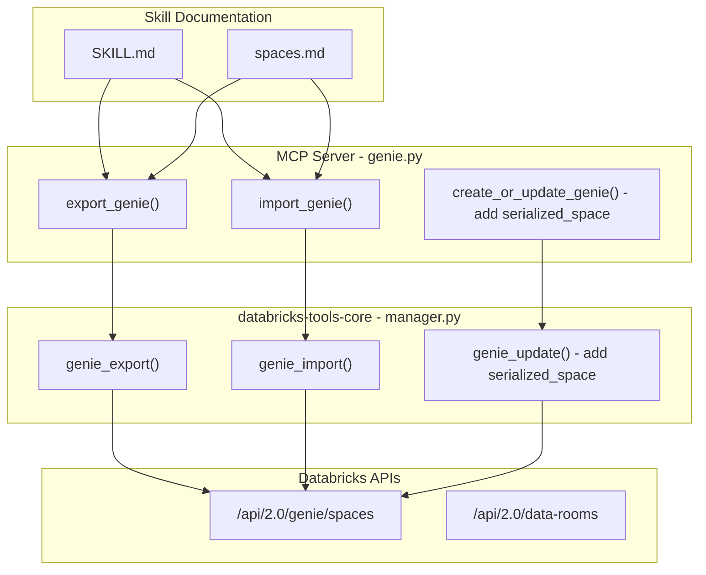

# Genie Export/Import/Migrate Skill Update

## Context

[GitHub Issue #83](https://github.com/databricks-solutions/ai-dev-kit/issues/83) requests `serialized_space` support for Genie Create/Update/Import tools. Currently:

- The MCP tools in `[genie.py](../../.ai-dev-kit/repo/databricks-mcp-server/databricks_mcp_server/tools/genie.py)` use `AgentBricksManager` which calls `/api/2.0/data-rooms` -- this API does **not** support `serialized_space`
- The public Genie API at `/api/2.0/genie/spaces` **does** support `serialized_space` for export (via `include_serialized_space=true` query param), import (via POST with `serialized_space` body), and update (via PUT with `serialized_space` body)
- The Python SDK (`w.genie`) already supports `get_space(include_serialized_space=True)`, `create_space(serialized_space=...)`, and `update_space(serialized_space=...)`
- The project's own code in `[etl/01_export_genie_spaces.py](etl/01_export_genie_spaces.py)` and `[router.py](tables_to_genies_apx/src/tables_genies/backend/router.py)` already uses the public API with `serialized_space` successfully

## Architecture

The changes span three layers:

## Changes

### 1. Backend: `databricks-tools-core/manager.py`

File: `[~/.ai-dev-kit/repo/databricks-tools-core/databricks_tools_core/agent_bricks/manager.py](../../.ai-dev-kit/repo/databricks-tools-core/databricks_tools_core/agent_bricks/manager.py)`

Add three new methods and a `_put` helper:

- `**_put(path, body)**` -- New HTTP helper (PUT method), needed since `update_space` uses PUT on `/api/2.0/genie/spaces/{id}` (current `_patch` won't work for this endpoint)
- `**genie_export(space_id)**` -- GET `/api/2.0/genie/spaces/{space_id}?include_serialized_space=true`. Returns full space dict including `serialized_space` string
- `**genie_import(warehouse_id, serialized_space, title, description, parent_path)**` -- POST `/api/2.0/genie/spaces` with `serialized_space` in body. Returns new space dict
- `**genie_update_with_serialized_space(space_id, serialized_space, title, description, warehouse_id)**` -- PUT `/api/2.0/genie/spaces/{space_id}` with `serialized_space` in body

### 2. MCP Tools: `genie.py`

File: `[~/.ai-dev-kit/repo/databricks-mcp-server/databricks_mcp_server/tools/genie.py](../../.ai-dev-kit/repo/databricks-mcp-server/databricks_mcp_server/tools/genie.py)`

Add two new `@mcp.tool` functions and update one:

- `**export_genie(space_id)**` -- Calls `manager.genie_export()`. Returns space metadata + `serialized_space` JSON string. This is the "export" step for cloning/migrating
- `**import_genie(warehouse_id, serialized_space, title, description, parent_path)**` -- Calls `manager.genie_import()`. Creates a new Genie Space from a serialized payload. This is the "import" step
- **Update `get_genie()`** -- Add optional `include_serialized_space` parameter that passes through to the export flow
- **Update `create_or_update_genie()`** -- Add optional `serialized_space` parameter. When provided, use the public `/api/2.0/genie/spaces` API instead of `/api/2.0/data-rooms`

### 3. Skill Documentation

#### Update `[SKILL.md](../../.cursor/skills/databricks-genie/SKILL.md)`

- Add `export_genie` and `import_genie` to the Space Management tools table
- Add a new "Export & Import" section to Quick Start
- Update "When to Use This Skill" to include migration/cloning scenarios

#### Update `[spaces.md](../../.cursor/skills/databricks-genie/spaces.md)`

- Add a new "## Export, Import & Migration" section covering:
  - Exporting a space (with `serialized_space`)
  - Importing a space into a different workspace/location
  - Cloning a space within the same workspace
  - Cross-workspace migration workflow
  - What `serialized_space` includes (tables, instructions, SQL queries, layout)

#### Update `[README.md](../../.cursor/skills/databricks-genie/README.md)`

- Add export/import to "Key Topics"
- Add migration to "When to Use"

### API Reference

Based on the [Databricks SDK docs](https://databricks-sdk-py.readthedocs.io/en/stable/workspace/dashboards/genie.html):

- **Export**: `w.genie.get_space(space_id, include_serialized_space=True)` -- returns `GenieSpace` with `serialized_space` field
- **Import**: `w.genie.create_space(warehouse_id, serialized_space, title=..., description=..., parent_path=...)` -- returns `GenieSpace`
- **Update**: `w.genie.update_space(space_id, serialized_space=..., title=..., description=..., warehouse_id=...)` -- returns `GenieSpace`

These SDK methods use the `/api/2.0/genie/spaces` endpoint (not `/api/2.0/data-rooms`).