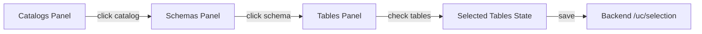

# Hierarchical Catalog Browser Implementation

## Architecture

Transform the current simple catalog list into a 3-panel master-detail interface:




## Current State

The Browse Catalogs page (`[catalog-browser.tsx](tables_to_genies_apx/src/tables_genies/ui/routes/_sidebar/catalog-browser.tsx)`) currently shows:

- Simple list of first 5 catalogs
- No drill-down capability
- No table selection mechanism
- "Next" button (disabled when no tables selected)

## Implementation Steps

### 1. Update UI Layout Structure

Transform from single-column to 3-panel grid layout:

```tsx
<div className="grid grid-cols-12 gap-4 h-[calc(100vh-200px)]">
  {/* Left Panel: Catalogs (4 columns) */}
  <div className="col-span-4 border rounded-lg overflow-auto">
    {/* Catalog list */}
  </div>
  
  {/* Middle Panel: Schemas (4 columns) */}
  {selectedCatalog && (
    <div className="col-span-4 border rounded-lg overflow-auto">
      {/* Schema list */}
    </div>
  )}
  
  {/* Right Panel: Tables (4 columns) */}
  {selectedSchema && (
    <div className="col-span-4 border rounded-lg overflow-auto">
      {/* Table list with checkboxes */}
    </div>
  )}
</div>
```

### 2. Add State Management

Add three state variables to track drill-down navigation:

```tsx
const [selectedCatalog, setSelectedCatalog] = useState<string | null>(null);
const [selectedSchema, setSelectedSchema] = useState<string | null>(null);
const [selectedTables, setSelectedTables] = useState<Set<string>>(new Set());
```

State transitions:

- Clicking a catalog → sets `selectedCatalog`, clears `selectedSchema` and `selectedTables`
- Clicking a schema → sets `selectedSchema`, clears `selectedTables`
- Checking/unchecking tables → updates `selectedTables` Set

### 3. Replace Suspense Hooks with Conditional useQuery

The existing Suspense hooks (`useListSchemasSuspense`, `useListTablesSuspense`) will throw errors when parameters are null. Replace with conditional `useQuery`:

```tsx
// Catalogs - always load
const { data: catalogs } = useQuery({
  queryKey: ['listCatalogs'],
  queryFn: async () => customInstance({ url: '/uc/catalogs', method: 'GET' }),
});

// Schemas - only load when catalog selected
const { data: schemas } = useQuery({
  queryKey: ['listSchemas', selectedCatalog],
  queryFn: async () => customInstance({ 
    url: `/uc/catalogs/${selectedCatalog}/schemas`, 
    method: 'GET' 
  }),
  enabled: !!selectedCatalog,
});

// Tables - only load when schema selected
const { data: tables } = useQuery({
  queryKey: ['listTables', selectedCatalog, selectedSchema],
  queryFn: async () => customInstance({ 
    url: `/uc/catalogs/${selectedCatalog}/schemas/${selectedSchema}/tables`, 
    method: 'GET' 
  }),
  enabled: !!selectedCatalog && !!selectedSchema,
});
```

### 4. Implement Catalog Panel (Left)

Features:

- Display all catalogs (no limit to 5)
- Highlight selected catalog with blue background
- Show catalog name and comment
- Click handler to select catalog

```tsx
<div className="divide-y">
  {catalogs?.map((catalog) => (
    <div
      key={catalog.name}
      onClick={() => {
        setSelectedCatalog(catalog.name);
        setSelectedSchema(null);
        setSelectedTables(new Set());
      }}
      className={`p-4 cursor-pointer hover:bg-slate-100 dark:hover:bg-slate-800 
        ${selectedCatalog === catalog.name ? 'bg-blue-50 dark:bg-blue-900/20 border-l-4 border-blue-600' : ''}`}
    >
      <h3 className="font-semibold">{catalog.name}</h3>
      <p className="text-sm text-slate-600">{catalog.comment || '(no description)'}</p>
    </div>
  ))}
</div>
```

### 5. Implement Schema Panel (Middle)

Features:

- Only visible when catalog selected
- Display all schemas in selected catalog
- Highlight selected schema
- Show schema name and comment
- Click handler to select schema

```tsx
{selectedCatalog && (
  <div className="col-span-4">
    <div className="border rounded-lg p-4">
      <h2 className="font-bold mb-4">Schemas in {selectedCatalog}</h2>
      {schemas?.map((schema) => (
        <div
          key={schema.name}
          onClick={() => {
            setSelectedSchema(schema.name);
            setSelectedTables(new Set());
          }}
          className={`p-3 cursor-pointer rounded hover:bg-slate-100 
            ${selectedSchema === schema.name ? 'bg-blue-50 border-l-4 border-blue-600' : ''}`}
        >
          <h4 className="font-medium">{schema.name}</h4>
          <p className="text-xs text-slate-500">{schema.comment || '(no description)'}</p>
        </div>
      ))}
    </div>
  </div>
)}
```

### 6. Implement Table Panel (Right) with Checkboxes

Features:

- Only visible when schema selected
- Display all tables with checkboxes
- Show table name, type, and comment
- Toggle selection on checkbox click
- Track selections in Set for efficient lookup

```tsx
{selectedSchema && (
  <div className="col-span-4">
    <div className="border rounded-lg p-4">
      <h2 className="font-bold mb-4">
        Tables in {selectedCatalog}.{selectedSchema}
      </h2>
      <div className="space-y-2">
        {tables?.map((table) => {
          const fqn = `${table.catalog_name}.${table.schema_name}.${table.name}`;
          const isSelected = selectedTables.has(fqn);
          
          return (
            <label
              key={fqn}
              className="flex items-start gap-3 p-3 border rounded hover:bg-slate-50 cursor-pointer"
            >
              <input
                type="checkbox"
                checked={isSelected}
                onChange={(e) => {
                  const newSelection = new Set(selectedTables);
                  if (e.target.checked) {
                    newSelection.add(fqn);
                  } else {
                    newSelection.delete(fqn);
                  }
                  setSelectedTables(newSelection);
                }}
                className="mt-1 w-4 h-4"
              />
              <div className="flex-1">
                <div className="font-medium">{table.name}</div>
                <div className="text-xs text-slate-600">
                  {table.table_type} {table.comment ? `• ${table.comment}` : ''}
                </div>
              </div>
            </label>
          );
        })}
      </div>
    </div>
  </div>
)}
```

### 7. Update Selection Save Logic

Save selection to backend when clicking "Next":

```tsx
const saveSelectionMutation = useSaveSelection();

const handleNext = async () => {
  await saveSelectionMutation.mutateAsync({
    table_fqns: Array.from(selectedTables)
  });
  navigate({ to: '/enrichment' });
};
```

### 8. Add Loading and Empty States

For each panel, handle:

- **Loading state**: Show "Loading..." text
- **Empty state**: Show "No items found" message
- **Error state**: Show error message with retry button

Example for schemas:

```tsx
{selectedCatalog && (
  <div className="col-span-4">
    {schemasLoading ? (
      <div className="p-4">Loading schemas...</div>
    ) : schemasError ? (
      <div className="p-4 text-red-600">Error loading schemas</div>
    ) : schemas?.length === 0 ? (
      <div className="p-4 text-slate-500">No schemas found</div>
    ) : (
      // Schema list...
    )}
  </div>
)}
```

### 9. Update Selection Counter

Update the bottom counter to show:

- Selected tables count
- Current drill-down path (optional)

```tsx
<div className="mt-4 flex items-center justify-between">
  <div className="text-sm text-slate-600">
    Selected: {selectedTables.size} tables
    {selectedCatalog && ` from ${selectedCatalog}`}
    {selectedSchema && `.${selectedSchema}`}
  </div>
  <button
    onClick={handleNext}
    disabled={selectedTables.size === 0}
    className="px-6 py-2 bg-blue-600 text-white rounded hover:bg-blue-700 
      disabled:opacity-50 disabled:cursor-not-allowed"
  >
    Next: Enrich Tables →
  </button>
</div>
```

## Visual Design

Each panel follows the same pattern:

- **Title bar**: Bold heading with context
- **Scrollable list**: Overflow-auto for long lists
- **Interactive items**: Hover effects, selected state highlighting
- **Responsive**: Fixed height to prevent layout shift

Selection indicators:

- **Selected catalog**: Blue left border + blue background tint
- **Selected schema**: Blue left border + blue background tint
- **Selected table**: Checkbox checked state

## Files to Modify

1. `**[catalog-browser.tsx](tables_to_genies_apx/src/tables_genies/ui/routes/_sidebar/catalog-browser.tsx)**` - Complete rewrite with 3-panel layout

## Testing Checklist

After implementation:

1. Click any catalog → schemas panel appears
2. Click any schema → tables panel appears
3. Check/uncheck tables → selection counter updates
4. Select catalog → clears schema and table selections
5. Click "Next" with 0 tables → button is disabled
6. Click "Next" with tables selected → navigates to enrichment
7. Verify selection is saved to backend
8. Test with catalog that has no schemas
9. Test with schema that has no tables
10. Verify all catalogs are shown (not just first 5)

