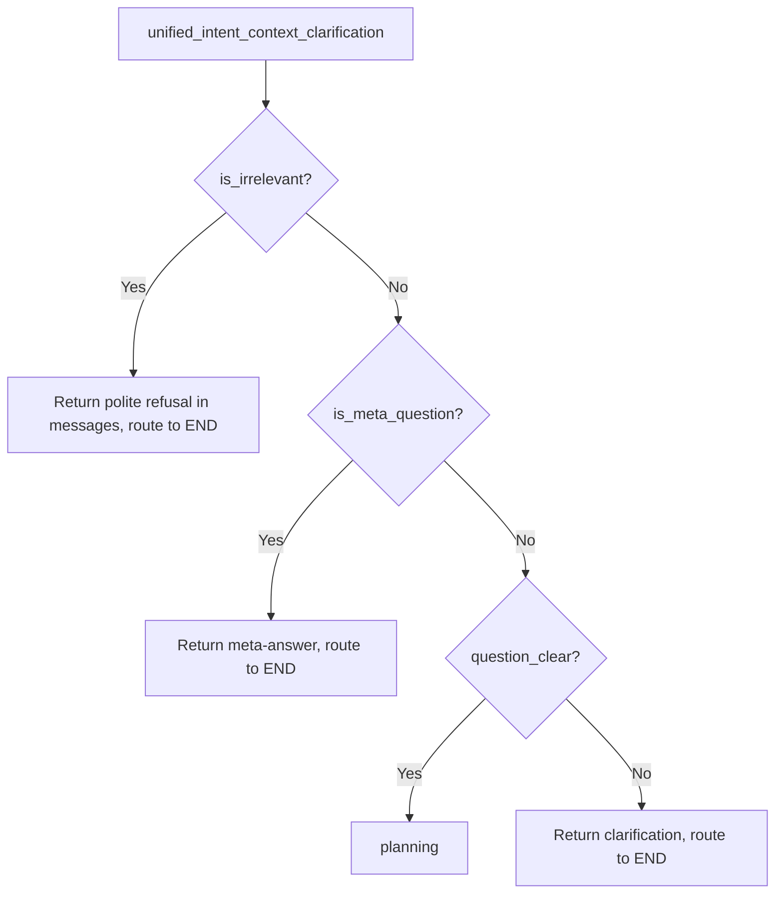

# Irrelevant Question Detection

## Design: Mirror the `is_meta_question` pattern

The existing `is_meta_question` feature is the exact blueprint. It works by:

1. LLM detects it via a task in the unified prompt
2. A boolean flag is returned in the JSON output
3. The clarification node returns early with a direct response in `messages`
4. The graph router sends it to `END`

We replicate this for irrelevant questions with a new `is_irrelevant` flag.




## Changes for `src/`

### 1. [src/multi_agent/core/state.py](src/multi_agent/core/state.py) — Add state field + reset

- Add `is_irrelevant: Optional[bool]` to `AgentState` (next to `is_meta_question` on line 62)
- Add `"is_irrelevant": False` to `get_reset_state_template()` (next to `"is_meta_question": False` on line 190)

### 2. [src/multi_agent/agents/clarification.py](src/multi_agent/agents/clarification.py) — Prompt + handling

**Prompt** (inside `unified_prompt`, before Task 1):

- Add a new **Task 0: Detect Irrelevant Questions** section explaining what counts as irrelevant (e.g., greetings, jokes, questions about weather, politics, sports — anything unrelated to healthcare data analytics)
- Add `"is_irrelevant": true/false` to ALL three JSON output cases (Cases 1-3)
- Add a **CASE 0: Irrelevant Question** output format (markdown refusal FIRST, then JSON) — same hybrid pattern as meta-question

**Handling** (after JSON parsing, around line 607, BEFORE the `is_meta_question` check):

- Extract `is_irrelevant = result.get("is_irrelevant", False)`
- Add an `if is_irrelevant:` block that mirrors the `if is_meta_question:` block (lines 608-651), but:
  - Returns a polite refusal message (e.g., "I'm a healthcare data analytics assistant. I can help with questions about patients, claims, providers, and medications. Could you rephrase your question?")
  - Sets `is_irrelevant: True` in the return dict
  - Sets `question_clear: True` and `pending_clarification: None` (so it doesn't accidentally trigger clarification)
  - Includes the refusal as an `AIMessage` in `messages`

### 3. [src/multi_agent/core/graph.py](src/multi_agent/core/graph.py) — Routing

In `route_after_unified` (line 47), add before the `is_meta_question` check:

```python
if state.get("is_irrelevant", False):
    return END
```

## Changes for `Notebooks/archive/Super_Agent_hybrid_original.py`

Same three changes, applied to the `# MAGIC` cells:

- **AgentState** (around line 780): Add `is_irrelevant: Optional[bool]`
- **RESET_STATE_TEMPLATE** (around line 1332): Add `"is_irrelevant": False`
- **unified_prompt** (around line 3620): Add Task 0 + CASE 0 + `is_irrelevant` to JSON schema
- **Handling** (around line 3850): Add `if is_irrelevant:` block before `if is_meta_question:`
- **route_after_unified** (around line 4729): Add `is_irrelevant` check

## Key Design Decisions

- **Check order**: `is_irrelevant` is checked BEFORE `is_meta_question` — if someone asks "What tables do you have about the weather?", it should be treated as a meta-question (it references system capabilities), not irrelevant
- **No new state field for the refusal message**: The refusal goes directly into `messages` as an `AIMessage`, same as meta-questions — no need for a separate `irrelevant_response` field
- **Hybrid streaming**: Irrelevant questions get a CASE 0 with markdown streamed first (polite refusal), then JSON — consistent with the existing pattern for meta-questions and clarifications

