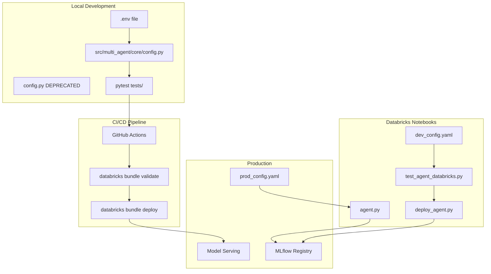

# Optimize Modular Multi-Agent Architecture

## Current State Analysis

You have a well-modularized codebase with 22 modules in `src/multi_agent/`, but configuration management is fragmented:

- Two config files: root `config.py` vs `src/multi_agent/core/config.py`
- Inconsistent config loading: ModelConfig inline, manual YAML parsing, lazy loading
- DAB exists for ETL (`databricks.yml`) but not agent deployment
- Good test foundation but not integrated into deployment workflow

## Optimization Strategy




## 1. Consolidate Configuration (Single Source of Truth)

**Problem**: Two config files create confusion about which to use when.

**Solution**: Keep `src/multi_agent/core/config.py`, deprecate root `config.py`.

**Changes**:

- Update `src/multi_agent/core/config.py` to be the ONLY config module
- Update `tests/conftest.py` to import from `src.multi_agent.core.config`
- Add deprecation warning to root `config.py` with migration instructions
- Update all agent modules to use standardized config pattern

**Config Loading Pattern** (everywhere):

```python
from multi_agent.core.config import get_config
config = get_config()  # Auto-detects environment (local/.env or Databricks/ModelConfig)
```

**Key Files**:

- `[src/multi_agent/core/config.py](src/multi_agent/core/config.py)` - Lines 321-400 already handle ModelConfig!
- `[tests/conftest.py](tests/conftest.py)` - Line 8 imports root config
- Root `[config.py](config.py)` - Add deprecation warning

## 2. Standardize Notebook Config Loading

**Problem**: `Notebooks/agent.py` and `Notebooks/test_agent_databricks.py` duplicate config logic.

**Solution**: Extract config to shared utility, reuse across notebooks.

**Create** `Notebooks/notebook_utils.py`:

```python
from mlflow.models import ModelConfig

def load_deployment_config(config_file: str = "../prod_config.yaml"):
    """Load config for notebook deployment/testing."""
    model_config = ModelConfig(development_config=config_file)
    return {
        "catalog": model_config.get("catalog_name"),
        "schema": model_config.get("schema_name"),
        "llm_endpoints": {...},
        "lakebase": {...},
        # ... all config values
    }
```

**Simplify**:

- `[Notebooks/agent.py](Notebooks/agent.py)` lines 86-143 → use `load_deployment_config()`
- `[Notebooks/test_agent_databricks.py](Notebooks/test_agent_databricks.py)` lines 40-80 → use `load_deployment_config()`
- `[Notebooks/deploy_agent.py](Notebooks/deploy_agent.py)` lines 31-96 → use `load_deployment_config()`

## 3. Extend Databricks Asset Bundle for Agent Deployment

**Problem**: DAB only handles ETL, not agent deployment/testing.

**Current** `[databricks.yml](databricks.yml)`:

- Has `etl_pipeline` job only
- Missing agent testing and deployment jobs
- No integration test workflow

**Add to** `databricks.yml`:

```yaml
resources:
  jobs:
    # Existing ETL pipeline
    etl_pipeline: {...}
    
    # NEW: Agent Integration Testing Job
    agent_integration_test:
      name: multi_agent_integration_test
      description: Test agent code before deployment
      tasks:
        - task_key: test_agent
          notebook_task:
            notebook_path: ./Notebooks/test_agent_databricks.py
            source: WORKSPACE
          timeout_seconds: 1200
      
    # NEW: Agent Deployment Job  
    agent_deploy:
      name: multi_agent_deploy
      description: Deploy agent to Model Serving
      tasks:
        - task_key: validate_agent
          notebook_task:
            notebook_path: ./Notebooks/test_agent_databricks.py
            source: WORKSPACE
        - task_key: deploy_agent
          depends_on:
            - task_key: validate_agent
          notebook_task:
            notebook_path: ./Notebooks/deploy_agent.py
            source: WORKSPACE
          timeout_seconds: 1800
```

**Commands**:

```bash
# Test agent in Databricks
databricks bundle run agent_integration_test -t dev

# Deploy to dev
databricks bundle run agent_deploy -t dev

# Deploy to prod
databricks bundle run agent_deploy -t prod
```

## 4. Add GitHub Actions CI/CD Pipeline

**Problem**: No automated testing before deployment.

**Create** `.github/workflows/ci-cd.yml`:

```yaml
name: CI/CD Pipeline

on:
  push:
    branches: [main, develop]
  pull_request:
    branches: [main, develop]

jobs:
  unit-tests:
    runs-on: ubuntu-latest
    steps:
      - uses: actions/checkout@v3
      - uses: actions/setup-python@v4
        with:
          python-version: '3.10'
      - name: Install dependencies
        run: |
          pip install -e .
          pip install pytest pytest-cov
      - name: Run unit tests
        run: pytest tests/ -m unit -v --cov=src

  validate-bundle:
    needs: unit-tests
    runs-on: ubuntu-latest
    steps:
      - uses: actions/checkout@v3
      - name: Install Databricks CLI
        run: pip install databricks-cli
      - name: Validate DAB
        env:
          DATABRICKS_HOST: ${{ secrets.DATABRICKS_HOST }}
          DATABRICKS_TOKEN: ${{ secrets.DATABRICKS_TOKEN }}
        run: databricks bundle validate

  deploy-dev:
    needs: validate-bundle
    if: github.ref == 'refs/heads/develop'
    runs-on: ubuntu-latest
    steps:
      - uses: actions/checkout@v3
      - name: Deploy to Dev
        env:
          DATABRICKS_HOST: ${{ secrets.DATABRICKS_HOST }}
          DATABRICKS_TOKEN: ${{ secrets.DATABRICKS_TOKEN }}
        run: |
          pip install databricks-cli
          databricks bundle deploy -t dev
          databricks bundle run agent_integration_test -t dev

  deploy-prod:
    needs: validate-bundle
    if: github.ref == 'refs/heads/main'
    runs-on: ubuntu-latest
    steps:
      - uses: actions/checkout@v3
      - name: Deploy to Production
        env:
          DATABRICKS_HOST: ${{ secrets.DATABRICKS_PROD_HOST }}
          DATABRICKS_TOKEN: ${{ secrets.DATABRICKS_PROD_TOKEN }}
        run: |
          pip install databricks-cli
          databricks bundle deploy -t prod
          databricks bundle run agent_deploy -t prod
```

**Branch Strategy**:

- `develop` branch → auto-deploy to dev workspace
- `main` branch → auto-deploy to prod workspace
- PRs trigger unit tests + bundle validation

## 5. Create Comprehensive Development Guide

**Create** `docs/DEVELOPMENT_GUIDE.md`:

Document the three development workflows:

### Workflow 1: Local Development (Fastest Iteration)

```bash
# Setup
python3 -m venv .venv
source .venv/bin/activate
pip install -e .

# Configure
cp .env.example .env
# Edit .env with your values

# Test individual modules
pytest tests/unit/test_planning_agent.py -v

# Test full system locally
python src/multi_agent/main.py
```

### Workflow 2: Databricks Notebook Dev (Real Services)

```bash
# Sync code to Databricks
databricks repos update <repo-id>

# Open in Databricks
# 1. Run Notebooks/test_agent_databricks.py
# 2. Iterate on src/multi_agent/ code
# 3. Use %autoreload 2 for live updates
```

### Workflow 3: Production Deployment (CI/CD)

```bash
# Via GitHub (Recommended)
git checkout develop
git commit -m "feat: add new agent"
git push  # Auto-deploys to dev

# Via CLI (Manual)
databricks bundle deploy -t prod
databricks bundle run agent_deploy -t prod
```

## 6. Add Pre-Commit Hooks for Code Quality

**Create** `.pre-commit-config.yaml`:

```yaml
repos:
  - repo: https://github.com/psf/black
    rev: 23.12.1
    hooks:
      - id: black
        files: ^(src/|tests/|Notebooks/)
  
  - repo: https://github.com/pycqa/flake8
    rev: 7.0.0
    hooks:
      - id: flake8
        args: [--max-line-length=120]
        files: ^(src/|tests/)
  
  - repo: local
    hooks:
      - id: pytest-unit
        name: Run unit tests
        entry: pytest tests/ -m unit -v
        language: system
        pass_filenames: false
        always_run: true
```

**Install**:

```bash
pip install pre-commit
pre-commit install
```

## Key Benefits of This Plan

### For CI/CD:

- Automated testing on every PR
- Bundle validation before merge
- Auto-deployment to dev/prod
- Rollback capability via git

### For Collaboration:

- Single config source → no confusion
- Standardized patterns → easy onboarding
- Pre-commit hooks → consistent code quality
- Clear workflow documentation

### For Development:

- Local dev: Fast iteration with `.env`
- Notebook dev: Real services with `dev_config.yaml`
- Production: Immutable config with `prod_config.yaml`
- All use same `src/multi_agent/core/config.py`

### For Testing:

- Unit tests: Fast, no Databricks required
- Integration tests: Via DAB on Databricks
- E2E tests: Automated in CI/CD before deploy
- Test pyramid: Unit → Integration → E2E

## Migration Path (Zero Downtime)

1. Implement config consolidation (backward compatible)
2. Add GitHub Actions (doesn't affect current deployment)
3. Extend DAB (runs alongside manual deployment)
4. Add pre-commit hooks (opt-in for developers)
5. Update documentation
6. Deprecate root `config.py` after 1 sprint

## Comparison: Your Question Revisited


| Aspect            | Modular (Recommended)                                        | Monolithic                             |
| ----------------- | ------------------------------------------------------------ | -------------------------------------- |
| CI/CD             | ✅ Test modules independently, deploy only changed components | ❌ Must redeploy entire 6,833-line file |
| Collaboration     | ✅ Parallel development, minimal merge conflicts              | ❌ Constant conflicts on single file    |
| Local Dev         | ✅ Fast: test one agent at a time                             | ❌ Slow: load entire system             |
| Notebook Dev      | ✅ Same as local (imports from src/)                          | ⚠️ Slightly simpler imports            |
| Integration Test  | ✅ Test pyramid: unit → integration → e2e                     | ❌ Only end-to-end possible             |
| Config Complexity | ⚠️ Current: 3 patterns (fixable!)                            | ✅ Inline (but duplicated)              |
| Maintenance       | ✅ <500 lines per file                                        | ❌ 6,833 lines to navigate              |


**Verdict**: After implementing this plan, modular approach is superior in ALL dimensions.