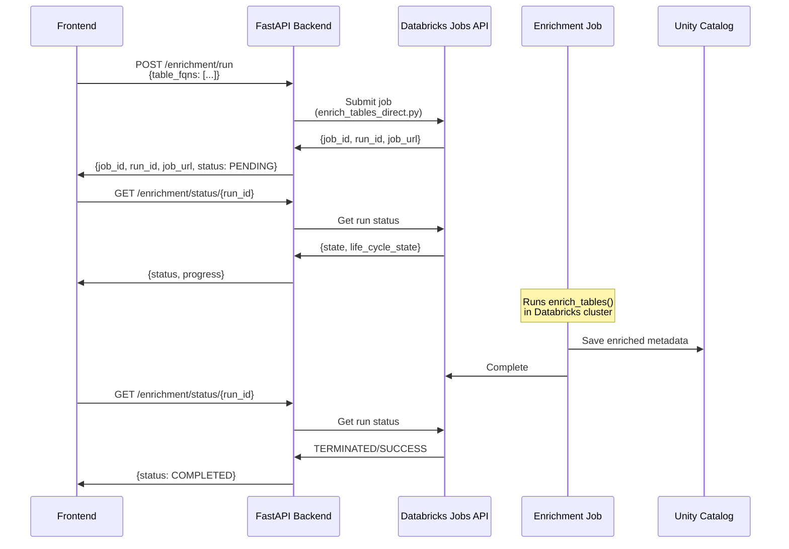

# Rewrite Table Enrichment Module

## Overview

Transform `[tables_to_genies/etl/enrich_tables_direct.py](tables_to_genies/etl/enrich_tables_direct.py)` by importing all table and column level enrichment logic from `[etl/02_enrich_table_metadata.py](etl/02_enrich_table_metadata.py)`, excluding space-level functionality.

## Current vs Target State

### Current File (188 lines)

- Basic table metadata retrieval
- Simple column sampling (5 values)
- No LLM enhancement
- No value dictionaries
- No chunk generation
- Basic error handling

### Target File (using 02_enrich_table_metadata.py)

- Full table metadata with filtering
- Column sampling with configurable size
- Value dictionaries (frequency counts)
- LLM-enhanced column comments
- LLM-synthesized table descriptions
- Multi-level chunk generation (table + column levels)
- Comprehensive error handling

## What to Remove (Space-Level)

From `[etl/02_enrich_table_metadata.py](etl/02_enrich_table_metadata.py)`, exclude:

1. **Functions to remove**:
  - `synthesize_space_description()` (lines 342-390)
  - `process_genie_space()` (lines 397-497) - only needed for .json processing
  - Space summary chunk creation (lines 586-638)
  - Space details chunk creation (lines 642-671)
2. **Parameters to remove**:
  - `genie_exports_volume`
  - `genie_exports_path`
  - All Genie space.json file handling
  - `space_id`, `space_title` from chunk metadata
3. **Notebook-specific code**:
  - All `# COMMAND ----------` blocks
  - All `# MAGIC` blocks
  - `dbutils.widgets` setup
  - `display()` calls

## What to Keep (Table + Column Levels)

### Helper Functions (Keep Verbatim)

From lines 73-340 in `[etl/02_enrich_table_metadata.py](etl/02_enrich_table_metadata.py)`:

1. `**get_table_metadata(table_identifier: str)**` (lines 73-107)
  - Gets DESCRIBE output
  - Filters metadata rows
  - Returns clean pandas DataFrame
2. `**sample_column_values(table_identifier, column_name, sample_size)**` (lines 110-142)
  - Samples distinct values
  - Converts to JSON-serializable types
  - Handles date/datetime objects
3. `**build_value_dictionary(table_identifier, column_name, max_values)**` (lines 145-170)
  - Builds value frequency map
  - Orders by frequency
  - Limits to max_values
4. `**enrich_column_metadata(columns_metadata, table_identifier, sample_size, max_unique_values, column_configs=None)**` (lines 173-226)
  - Enriches columns with samples
  - Builds value dictionaries
  - Handles column configs (can pass None)
5. `**enhance_comments_with_llm(columns, llm_endpoint)**` (lines 229-285)
  - Uses ai_query() for LLM enhancement
  - Adds `enhanced_comment` field
  - Includes safe JSON serialization
6. `**synthesize_table_description(table_identifier, enriched_columns, llm_endpoint)**` (lines 288-339)
  - Uses column metadata to create table description
  - Returns 2-3 sentence summary
  - Fallback to simple description
7. `**json_serializer(obj)**` (lines 532-540)
  - Safe serialization for dates/objects

### Chunk Generation (Adapt from Lines 674-811)

Keep and adapt from `[etl/02_enrich_table_metadata.py](etl/02_enrich_table_metadata.py)`:

1. **Table Overview Chunks** (lines 674-735)
  - One chunk per table
  - Includes table description
  - Column list with brief descriptions
  - Categorical field summary
  - **Remove**: space_id, space_title references
2. **Column Detail Chunks** (lines 738-811)
  - One chunk per column
  - Full descriptions with sample values
  - Value dictionary top entries
  - Classification (categorical, temporal, identifier)
  - **Remove**: space references

### Chunk Schema (Modified)

```python
{
    'chunk_id': int,
    'chunk_type': 'table_overview' | 'column_detail',
    # REMOVED: 'space_id', 'space_title'
    'table_name': str,
    'table_fqn': str,  # ADD: full qualified name
    'column_name': str | None,
    'searchable_content': str,
    'is_categorical': bool,
    'is_temporal': bool,
    'is_identifier': bool,
    'has_value_dictionary': bool,
    'metadata_json': str
}
```

## New Module Structure

Transform from class-based to function-based module using Spark SQL:

```python
# Module-level functions (copy verbatim from parent)
def get_table_metadata(table_identifier: str) -> pd.DataFrame
def sample_column_values(table_identifier: str, column_name: str, sample_size: int = 100) -> List[Any]
def build_value_dictionary(table_identifier: str, column_name: str, max_values: int = 50) -> Dict[str, int]
def enrich_column_metadata(columns_metadata: pd.DataFrame, table_identifier: str, ...) -> List[Dict]
def enhance_comments_with_llm(columns: List[Dict], llm_endpoint: str) -> List[Dict]
def synthesize_table_description(table_identifier: str, enriched_columns: List[Dict], llm_endpoint: str) -> str
def json_serializer(obj)

# New orchestration functions
def enrich_table(table_fqn: str, sample_size: int = 20, max_unique_values: int = 50, llm_endpoint: str = "databricks-claude-sonnet-4-5") -> Dict[str, Any]
def enrich_tables(table_fqns: List[str], sample_size: int = 20, max_unique_values: int = 50, llm_endpoint: str = "databricks-claude-sonnet-4-5") -> List[Dict[str, Any]]
def create_table_chunks(enriched_tables: List[Dict]) -> List[Dict]
```

## Implementation Steps

1. **Remove class structure** - convert to module-level functions
2. **Import pandas and PySpark** - needed for DataFrame operations
3. **Copy helper functions VERBATIM** - lines 73-340 from parent file (use spark.sql throughout)
4. **Create new `enrich_table()` orchestration function**:
  - Call `get_table_metadata()`
  - Call `enrich_column_metadata()` with samples + value dicts
  - Call `enhance_comments_with_llm()`
  - Call `synthesize_table_description()`
  - Return enriched dict
5. **Create `enrich_tables()` batch function** - processes list of FQNs
6. **Add `create_table_chunks()` method** - adapt lines 674-811, remove space references

## Key Adaptations

### Use Spark SQL Throughout

**Keep parent's pattern unchanged:**

```python
# All queries use spark.sql() - NO cursor.execute()
result = spark.sql(query).collect()
df = spark.sql(f"DESCRIBE {table_identifier}")
llm_result = spark.sql(f"SELECT ai_query('{llm_endpoint}', ?) as result", [prompt]).collect()[0]['result']
```

### Pandas Integration

Parent uses `df.toPandas()` - **keep this verbatim**:

```python
df_description = spark.sql(f"DESCRIBE {table_identifier}")
df_clean = df_description.filter(...).toPandas()  # Returns pandas DataFrame
```

### No Connection Management

**Remove all** `databricks.sql.connect()` and cursor code. Use global `spark` session (available in Databricks runtime).

## File Structure (Estimated ~650 lines)

```
1-30:    Imports and docstring (pandas, pyspark.sql, json, datetime, typing)
31-60:   json_serializer() helper - verbatim from parent line 532-540
61-140:  get_table_metadata() - verbatim from parent lines 73-107
141-190: sample_column_values() - verbatim from parent lines 110-142
191-230: build_value_dictionary() - verbatim from parent lines 145-170
231-290: enrich_column_metadata() - verbatim from parent lines 173-226
291-360: enhance_comments_with_llm() - verbatim from parent lines 229-285
361-420: synthesize_table_description() - verbatim from parent lines 288-339
421-520: enrich_table() - NEW orchestration function
521-560: enrich_tables() - NEW batch processing function
561-600: create_table_chunks() - adapted from parent lines 674-811 (table + column only)
601-650: save_to_unity_catalog() - NEW function to save results + chunks to UC tables
```

### Entry Point for Databricks Job

Add at end of file:

```python
if __name__ == "__main__":
    import sys
    
    # Parse job parameters
    table_fqns = sys.argv[1].split(',') if len(sys.argv) > 1 else []
    sample_size = int(sys.argv[2]) if len(sys.argv) > 2 else 20
    max_unique_values = int(sys.argv[3]) if len(sys.argv) > 3 else 50
    
    # Run enrichment
    enriched = enrich_tables(table_fqns, sample_size, max_unique_values)
    chunks = create_table_chunks(enriched)
    
    # Save to UC
    save_to_unity_catalog(enriched, chunks)
```

## Architecture: Job Submission Pattern

The enrichment module will run as a **Databricks Job**, not inline in the backend:




### Backend Changes Needed

In `router.py`, replace inline enrichment (lines 121-188) with job submission:

1. **New endpoint: POST /enrichment/run**
  - Use Databricks Jobs API to submit job
  - Pass `table_fqns` as job parameter
  - Return: `{job_id, run_id, job_url, status: "PENDING"}`
2. **Updated endpoint: GET /enrichment/status/{run_id}**
  - Query Jobs API for run status
  - Map lifecycle_state to status
  - Return: `{run_id, status, job_url, result_state}`
3. **New endpoint: GET /enrichment/results**
  - Query Unity Catalog table for enriched results
  - Filter by run_id or table_fqns

### Frontend Integration

Frontend will:

1. Show clickable job URL (opens Databricks job UI)
2. Poll `/enrichment/status/{run_id}` every 5-10 seconds
3. Update progress bar based on job lifecycle state
4. Fetch results from `/enrichment/results` when complete

## Testing Considerations

After rewrite, the enriched output will include:

- `table_description` (LLM-synthesized)
- `enriched_columns` with `enhanced_comment` and `value_dictionary`
- Multi-level chunks for vector search indexing
- Results saved to Unity Catalog table for retrieval

## Dependencies

Required:

- `pandas` (for DataFrame operations)
- PySpark (available in Databricks runtime)
- Access to global `spark` session (Databricks environment)

Remove:

- `databricks-sdk` (not needed for this module)
- `databricks-sql-connector` (replaced by spark.sql)

