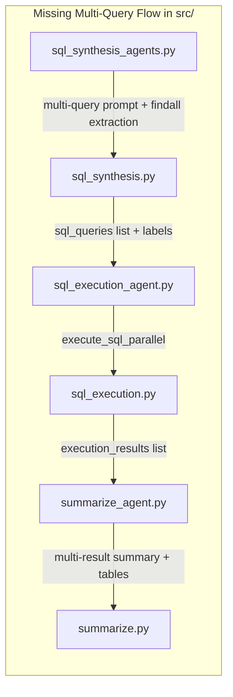

# Sync src/ with Super_Agent_hybrid_original.py

## Gap Analysis Summary

The notebook was overhauled to support **multi-part questions** that yield multiple SQL queries and results. This feature flows through the entire pipeline but `src/` was only partially updated. The changes cascade across 7 files.

## GAP 1: Multi-query SQL extraction utilities -- MISSING entirely

The notebook defines these utility functions (lines 2388-2587) that do not exist anywhere in `src/`:

- `SQL_KEYWORDS` constant
- `_split_multi_query_block(block)` -- splits a SQL block containing multiple semicolon-separated queries
- `extract_all_sql_queries(content)` -- extracts all SQL queries from markdown or raw content
- `extract_sql_queries_from_agent_result(result, agent_name)` -- high-level helper for agent results

**Action:** Create a new utility file `src/multi_agent/utils/sql_extraction.py` containing these functions, copied from the notebook (lines 2388-2587).

## GAP 2: SQLSynthesisTableAgent -- prompts and extraction logic outdated

File: [src/multi_agent/agents/sql_synthesis_agents.py](src/multi_agent/agents/sql_synthesis_agents.py)

**2a. System prompt** (line 157-191): Missing the MULTI-QUERY STRATEGY and enhanced OUTPUT FORMAT sections. The notebook version (lines 1613-1668) adds instructions for generating multiple `\`sql` code blocks with leading comments and semicolons.

**2b. SQL extraction in `synthesize_sql()**` (lines 232-260): Uses `re.search()` to find only the FIRST SQL block. The notebook version (lines 1720-1753) uses `re.findall()` to capture ALL `\`sql` blocks and joins them, enabling multi-query extraction.

## GAP 3: SQLSynthesisGenieAgent -- prompts and extraction logic outdated

File: [src/multi_agent/agents/sql_synthesis_agents.py](src/multi_agent/agents/sql_synthesis_agents.py)

**3a. System prompt** (lines 584-652): Missing MULTI-QUERY STRATEGY section. The notebook version (lines 2071-2167) adds instructions for generating separate SQL queries per sub-question with `\`sql` code blocks.

**3b. SQL extraction in `synthesize_sql()**` (lines 815-840): Uses `re.search()` for single block. The notebook version (lines 2326-2358) uses `re.findall()` to capture ALL blocks.

## GAP 4: sql_synthesis_table_node -- no multi-query support

File: [src/multi_agent/agents/sql_synthesis.py](src/multi_agent/agents/sql_synthesis.py)

The `sql_synthesis_table_node()` function (line 278-382) only extracts a single `sql_query` and returns it. The notebook version (lines 4289-4404) uses `extract_sql_queries_from_agent_result()` to extract multiple queries and returns:

- `sql_queries`: list of all SQL queries
- `sql_query_labels`: per-query labels from leading comments
- `sql_query`: first query (backward compat)

## GAP 5: sql_synthesis_genie_node -- no multi-query support

File: [src/multi_agent/agents/sql_synthesis.py](src/multi_agent/agents/sql_synthesis.py)

Same as GAP 4. The `sql_synthesis_genie_node()` function (line 386-528) only handles a single `sql_query`. The notebook version (lines 4407-4554) returns `sql_queries` list + `sql_query_labels`.

## GAP 6: SQLExecutionAgent.execute_sql_parallel() -- MISSING

File: [src/multi_agent/agents/sql_execution_agent.py](src/multi_agent/agents/sql_execution_agent.py)

The `execute_sql_parallel()` method (notebook lines 2842-2910) using `concurrent.futures.ThreadPoolExecutor` is entirely missing. This method:

- Executes multiple SQL queries concurrently with independent connections
- Returns ordered results with `query_number` field
- Has a fast-path for single queries (skips threading overhead)

## GAP 7: sql_execution_node -- single query only

File: [src/multi_agent/agents/sql_execution.py](src/multi_agent/agents/sql_execution.py)

The node function (lines 25-108) only handles a single `sql_query`. The notebook version (lines 4558-4644):

- Reads `sql_queries` from state (falls back to single `sql_query`)
- Uses `execute_sql_parallel()` for concurrent execution
- Returns both `execution_results` (list) and `execution_result` (first, backward compat)
- Emits per-query writer events

Also, `extract_execution_context()` (line 18-22) only extracts `sql_query`. The notebook version (line 3378-3384) also extracts `sql_queries` and `sql_query_labels`.

## GAP 8: ResultSummarizeAgent._build_summary_prompt -- single query only

File: [src/multi_agent/agents/summarize_agent.py](src/multi_agent/agents/summarize_agent.py)

The `_build_summary_prompt()` (lines 160-282) only handles a single SQL query and execution result. The notebook version (lines 3061-3285):

- Handles `sql_queries` list and `sql_query_labels` list
- Handles `execution_results` list with per-result previews
- Adds **Code Annotation for Human Readability** instructions (translate raw codes like ICD-10, CPT into descriptions)
- Has token protection per result set

## GAP 9: ResultSummarizeAgent.generate_summary -- single result downloadable tables

File: [src/multi_agent/agents/summarize_agent.py](src/multi_agent/agents/summarize_agent.py)

The `generate_summary()` (lines 65-99) only appends downloadable tables for a single `execution_result`. The notebook version (lines 2956-3000) iterates over `execution_results` list and appends per-query labeled downloadable tables.

## GAP 10: summarize.py -- extract_summarize_context missing multi-query fields

File: [src/multi_agent/agents/summarize.py](src/multi_agent/agents/summarize.py)

The `extract_summarize_context()` (lines 55-72) does not extract `sql_queries`, `sql_query_labels`, or `execution_results`. The notebook version (lines 3386-3406) includes all of these.

Also, the `_SimpleSummarizeAgent._build_summary_prompt()` (lines 170-248) lacks multi-query support.

## Commit-by-Commit Verification

Validated plan against all 17 commits between `9f268ca` and HEAD:

**Notebook-only commits (NOT synced to src/ -- captured by plan):**

- `bad0b3a` -- Initial multi-query support: AgentState fields, extract_all_sql_queries(), multi-query nodes, multi-result summary. **Covers GAPs 1,4,5,7,8,9,10**
- `5ca0d9a` -- execute_sql_parallel() and parallel sql_execution_node. **Covers GAPs 6, 7**
- `03e5ec7` / `9f5a7a8` -- Refactored extract_all_sql_queries() to return labels, added _split_multi_query_block(), SQL_KEYWORDS, extract_sql_queries_from_agent_result(), and re.findall() extraction in both agent classes. **Covers GAPs 1, 2b, 3b**
- `bf15da1` -- Code Annotation for Human Readability in summary prompt. **Covers GAP 8**
- `e398945` -- MULTI-QUERY STRATEGY and OUTPUT FORMAT in both SQLSynthesis agent prompts. **Covers GAPs 2a, 3a**
- `809329b` -- Notebook setup refactoring (no src/ impact)
- `66c3125` + `71d4abd` -- Credential fix + revert (net zero change)

**Commits that DID update src/ (already in sync):**

- `3e17a4a` -- Added meta-question examples to `src/clarification.py` (src/ actually has MORE than notebook here -- src/ is superset)
- `d9f3155` -- Added meta-question fast-path patterns to `src/clarification.py`
- `c9fd4ea` -- Removed fast-path logic from BOTH notebook and `src/clarification.py`
- `349f26e` -- Refactored package structure in BOTH notebook and `src/sql_synthesis.py`
- `b9211f4` -- Added irrelevant question detection in BOTH notebook and `src/` (state.py, clarification.py, graph.py)
- `4efb181` -- Added new state fields in BOTH notebook and `src/` (state.py, conversation.py)

**Conclusion:** Plan is validated. All 12 todos map exactly to the 6 notebook-only commits that introduced the multi-query pipeline. No gaps were missed.

## NOTE: Items already in sync

- **AgentState** fields (`sql_queries`, `sql_query_labels`, `execution_results`) -- already present in `src/multi_agent/core/state.py` (commit `4efb181`)
- **get_reset_state_template()** -- already includes the new fields in both places (commit `4efb181`)
- **Graph routing** in `src/multi_agent/core/graph.py` -- matches notebook (commit `b9211f4`)
- **Clarification prompt** in `src/multi_agent/agents/clarification.py` -- matches notebook; src/ actually has slightly MORE meta-question examples (commits `3e17a4a`, `d9f3155`)
- **Irrelevant question detection** -- in sync across state, clarification, and graph (commit `b9211f4`)
- **Fast-path removal** -- removed from both notebook and src/ (commit `c9fd4ea`)

