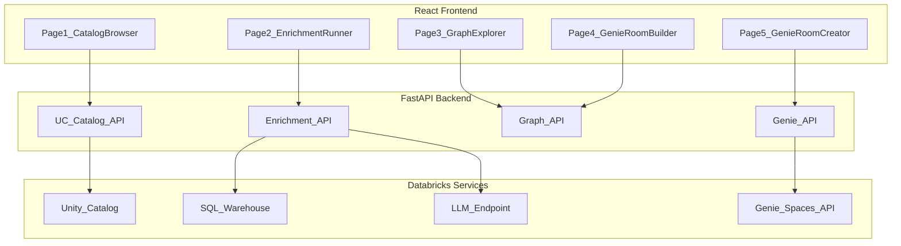

# Tables-to-Genies: Full-Stack Databricks App

# Overall Instruction

- prefer to use databricks skills/MCP tools when available as compared to alternative solutions

## Target Environment

- **Workspace**: `fevm-serverless-dbx-unifiedchat.cloud.databricks.com` (prod)
- **Base catalog**: `serverless_dbx_unifiedchat_catalog`
- **Base schema**: `multi_agent_genie`
- **App framework**: APX (FastAPI + React)
- **All code/artifacts**: `tables_to_genies/` folder

---

## Architecture Overview




---

## Phase 1: Synthesize Tables (20+ Domains)

Use **Python + Faker on a Databricks cluster** via the `run_python_file_on_databricks` MCP tool. This approach gives the richest data quality with non-linear distributions, referential integrity, row coherence, and domain-specific realism.

### Execution Strategy

Following the `synthetic-data-generation` skill pattern:

1. **Start a cluster** on the prod workspace (or use a running one)
2. **Install libraries** once: `%pip install faker holidays` via `execute_databricks_command`
3. **Write per-domain Python scripts** locally under `tables_to_genies/data_synthesis/`
4. **Execute each script** via `run_python_file_on_databricks`, reusing `cluster_id` + `context_id` for speed
5. Each script creates its own catalog/schema via `spark.sql()` and saves tables via `spark.createDataFrame().write.saveAsTable()`

### Domain Layout (simulates real-world catalog sprawl)

To satisfy the "mix some domains under a catalog or schema" requirement:

- **Catalog `sports_analytics**`
  - Schema `world_cup_2026` (5 tables: teams, players, matches, stadiums, group_standings)
  - Schema `nfl` (5 tables: teams, players, games, stats, standings)
  - Schema `nba` (5 tables: teams, players, games, stats, draft_picks)
- **Catalog `science_research**`
  - Schema `nasa` (5 tables: missions, astronauts, spacecraft, launches, discoveries)
  - Schema `drug_discovery` (5 tables: compounds, trials, targets, researchers, publications)
  - Schema `semiconductors` (5 tables: chips, fabrication_plants, wafer_lots, defects, test_results)
- **Catalog `ai_tech**`
  - Schema `genai` (5 tables: models, benchmarks, training_runs, datasets, papers)
- **Catalog `health_nutrition**`
  - Schema `nutrition` (5 tables: foods, nutrients, daily_intake, recipes, dietary_plans)
  - Schema `pharmaceuticals` (5 tables: drugs, manufacturers, prescriptions, adverse_events, patents)
- **Catalog `entertainment**`
  - Schema `iron_chef` (5 tables: chefs, battles, ingredients, judges, episodes)
  - Schema `japanese_anime` (5 tables: series, studios, characters, episodes, ratings)
  - Schema `rock_bands` (5 tables: bands, albums, songs, tours, awards)
- **Catalog `insurance_claims**` (mixed domain)
  - Schema `claims` (5 tables: claims, claimants, policies, adjusters, payments)
  - Schema `providers` (5 tables: providers, facilities, specialties, networks, contracts)
- **Catalog `history**`
  - Schema `world_war_2` (5 tables: battles, leaders, campaigns, casualties, treaties)
  - Schema `roman_history` (5 tables: emperors, provinces, legions, battles, monuments)
- **Catalog `global_policy**`
  - Schema `international_policy` (5 tables: treaties, organizations, countries, sanctions, resolutions)
- **Catalog `serverless_dbx_unifiedchat_catalog**` (existing, mixed-in)
  - Schema `demo_mixed` (3 tables from different domains mixed together -- e.g., a genai_leaderboard, nfl_superbowl_winners, nutrition_vitamins)

**Total**: 18 primary domains + 1 mixed schema = 93+ tables, each with 5+ columns and 100+ rows.

### Script Organization

```
tables_to_genies/data_synthesis/
├── config.py                    # Shared constants: SEED, date ranges, catalog/schema names
├── utils.py                     # Shared helpers: create_infrastructure(), save_table()
├── gen_sports.py                # sports_analytics catalog (world_cup, nfl, nba)
├── gen_science.py               # science_research catalog (nasa, drug_discovery, semiconductors)
├── gen_ai_tech.py               # ai_tech catalog (genai)
├── gen_health.py                # health_nutrition catalog (nutrition, pharmaceuticals)
├── gen_entertainment.py         # entertainment catalog (iron_chef, anime, rock_bands)
├── gen_insurance.py             # insurance_claims catalog (claims, providers)
├── gen_history.py               # history catalog (ww2, roman)
├── gen_global_policy.py         # global_policy catalog (international_policy)
├── gen_mixed.py                 # serverless_dbx_unifiedchat_catalog.demo_mixed
└── run_all.py                   # Orchestrator: imports + runs all generators
```

### Data Generation Principles (from synthetic-data-generation skill)

- **Pandas for generation, Spark for saving**: Generate with numpy/Faker (faster), convert to Spark DataFrame for `saveAsTable()`
- **Non-linear distributions**: Log-normal for values/amounts, exponential for durations, Pareto for popularity, weighted categoricals
- **Referential integrity**: Master tables first (e.g., teams), then child tables reference valid IDs (e.g., players.team_id)
- **Row coherence**: Correlated attributes within a row (e.g., Enterprise tier -> higher amounts -> faster resolution)
- **Domain-specific realism**: Real team names for NFL/NBA, real country names for World Cup, real element names for drug discovery, etc.
- **Reproducibility**: `SEED = 42` for all random generators
- **100+ rows per table**: Enough data for meaningful queries and Genie exploration

---

## Phase 2: APX App Setup

Follow the `databricks-app-apx` skill (`~/.cursor/skills/databricks-app-apx/SKILL.md`).

### Prerequisites

1. Install `uv` (Python package manager): `brew install uv`
2. Install `bun` (JS runtime): `brew tap oven-sh/bun && brew install bun`
3. Verify git is available

### Initialize APX Project

```bash
cd tables_to_genies
uvx --from git+https://github.com/databricks-solutions/apx.git apx init
```

This scaffolds a FastAPI + React project with:

- Auto-generated OpenAPI client (Orval)
- TanStack Router (file-based routing)
- shadcn/ui components
- Type checking (basedpyright + tsc)

### APX MCP Commands (dev workflow)

The APX skill uses MCP commands for the dev loop. Verify availability after init:

- `apx dev start` -- start dev servers (backend + frontend + OpenAPI watcher)
- `apx dev status` -- check running services
- `apx dev check` -- type check both Python and TypeScript
- `shadcn` -- add UI components (button, card, table, badge, etc.)

### App Structure

```
tables_to_genies/
├── data_synthesis/              # Phase 1 scripts
│   └── gen_*.py
├── etl/                         # Phase 4 adapted enrichment
│   └── enrich_tables_direct.py
├── graphrag/                    # Phase 5 GraphRAG integration
│   └── build_table_graph.py
├── src/{app_name}/
│   ├── backend/
│   │   ├── models.py            # Pydantic models (3-model pattern per APX skill)
│   │   ├── router.py            # API routes (response_model + operation_id required)
│   │   ├── uc_browser.py        # UC catalog browsing logic
│   │   ├── enrichment.py        # Enrichment orchestration
│   │   ├── graph_builder.py     # GraphRAG bridge
│   │   └── genie_creator.py     # Genie room creation
│   └── ui/
│       └── routes/_sidebar/
│           ├── catalog-browser.tsx    # Page 1
│           ├── enrichment.tsx         # Page 2
│           ├── graph-explorer.tsx     # Page 3 (Cytoscape.js)
│           ├── genie-builder.tsx      # Page 4
│           └── genie-create.tsx       # Page 5
├── app.yaml                     # Databricks App config
└── requirements.txt
```

---

## Phase 3: Backend API Routes (FastAPI)

Follow APX skill patterns from `~/.cursor/skills/databricks-app-apx/backend-patterns.md`:

- **3-model pattern**: `EntityIn` (input), `EntityOut` (full output), `EntityListOut` (summary for lists)
- **Every route MUST have**: `response_model` (enables OpenAPI generation) + `operation_id` (becomes frontend hook name)
- **operation_id naming**: `listX`, `getX`, `createX`, `updateX`, `deleteX` in camelCase
- **Type hints everywhere**: enables basedpyright checking

### Route Group 1: UC Catalog Browser (`/api/uc/`)

Models: `CatalogOut`, `SchemaOut`, `TableOut`, `ColumnOut`, `TableSelectionIn`, `TableSelectionOut`

- `GET /api/uc/catalogs` -- `operation_id="listCatalogs"`, `response_model=list[CatalogOut]`
- `GET /api/uc/catalogs/{catalog}/schemas` -- `operation_id="listSchemas"`, `response_model=list[SchemaOut]`
- `GET /api/uc/catalogs/{catalog}/schemas/{schema}/tables` -- `operation_id="listTables"`, `response_model=list[TableOut]`
- `GET /api/uc/tables/{fqn}/columns` -- `operation_id="getTableColumns"`, `response_model=list[ColumnOut]`
- `POST /api/uc/selection` -- `operation_id="saveSelection"`, `response_model=TableSelectionOut`
- `GET /api/uc/selection` -- `operation_id="getSelection"`, `response_model=TableSelectionOut`

Uses Databricks SDK (`databricks.sdk.WorkspaceClient`) with `list_catalogs()`, `list_schemas()`, `list_tables()`.

### Route Group 2: Enrichment (`/api/enrichment/`)

Models: `EnrichmentRunIn`, `EnrichmentStatusOut`, `EnrichmentResultOut`, `EnrichmentResultListOut`

- `POST /api/enrichment/run` -- `operation_id="runEnrichment"`, `response_model=EnrichmentStatusOut`
- `GET /api/enrichment/status/{job_id}` -- `operation_id="getEnrichmentStatus"`, `response_model=EnrichmentStatusOut`
- `GET /api/enrichment/results` -- `operation_id="listEnrichmentResults"`, `response_model=list[EnrichmentResultListOut]`
- `GET /api/enrichment/results/{table_fqn}` -- `operation_id="getEnrichmentResult"`, `response_model=EnrichmentResultOut`

Adapts `[etl/02_enrich_table_metadata.py](etl/02_enrich_table_metadata.py)` to work without Genie space.json -- accepts table FQNs directly. Runs enrichment via SQL Warehouse using `databricks-sql-connector`.

### Route Group 3: Graph (`/api/graph/`)

Models: `GraphBuildStatusOut`, `GraphDataOut`, `GraphNodeOut`, `GraphEdgeOut`

- `POST /api/graph/build` -- `operation_id="buildGraph"`, `response_model=GraphBuildStatusOut`
- `GET /api/graph/status/{job_id}` -- `operation_id="getGraphStatus"`, `response_model=GraphBuildStatusOut`
- `GET /api/graph/data` -- `operation_id="getGraphData"`, `response_model=GraphDataOut`
- `GET /api/graph/node/{table_fqn}` -- `operation_id="getGraphNode"`, `response_model=GraphNodeOut`

### Route Group 4: Genie Rooms (`/api/genie/`)

Models: `GenieRoomIn`, `GenieRoomOut`, `GenieRoomListOut`, `GenieCreationStatusOut`, `CreatedGenieRoomOut`

- `POST /api/genie/rooms` -- `operation_id="createGenieRoom"`, `response_model=GenieRoomOut`
- `GET /api/genie/rooms` -- `operation_id="listGenieRooms"`, `response_model=list[GenieRoomListOut]`
- `DELETE /api/genie/rooms/{id}` -- `operation_id="deleteGenieRoom"`
- `POST /api/genie/create-all` -- `operation_id="createAllGenieRooms"`, `response_model=GenieCreationStatusOut`
- `GET /api/genie/create-status` -- `operation_id="getGenieCreationStatus"`, `response_model=GenieCreationStatusOut`
- `GET /api/genie/created` -- `operation_id="listCreatedGenieRooms"`, `response_model=list[CreatedGenieRoomOut]`

Uses the MCP `create_or_update_genie` tool logic.

---

## Phase 4: Adapt Enrichment Script

Create `tables_to_genies/etl/enrich_tables_direct.py` by adapting the core functions from `[etl/02_enrich_table_metadata.py](etl/02_enrich_table_metadata.py)`:

**Key adaptations**:

- Remove Genie space.json dependency -- accept `List[str]` of table FQNs as input
- Replace `spark.sql()` calls with `databricks-sql-connector` for execution from the app backend
- Replace `ai_query()` SQL function with direct LLM endpoint calls via `databricks-sdk`
- Keep the enrichment logic: `get_table_metadata()`, `sample_column_values()`, `build_value_dictionary()`, `enrich_column_metadata()`, `enhance_comments_with_llm()`, `synthesize_table_description()`
- Output structured JSON suitable for both display in the app and input to GraphRAG
- Store enrichment results in a Delta table (`serverless_dbx_unifiedchat_catalog.multi_agent_genie.enriched_tables_direct`)

---

## Phase 5: Microsoft GraphRAG Integration

Create `tables_to_genies/graphrag/build_table_graph.py`:

**Input**: Enriched table metadata (from Phase 4)

**GraphRAG Approach**:

1. Convert table/column metadata into text documents (one per table)
2. Run Microsoft GraphRAG indexing pipeline to extract entities and relationships
3. GraphRAG identifies: shared concepts, domain relationships, column-name overlaps, data-type patterns
4. Build community hierarchy (clusters of related tables)

**Output**: Graph data structure with:

- **Nodes**: Each table is a node with attributes (catalog, schema, table name, description, column count, domain)
- **Edges**: Relationships between tables (shared columns, same schema, semantic similarity, GraphRAG-detected relationships)
- **Communities**: Groups of related tables (detected by GraphRAG)

**Additional edge detection** (beyond GraphRAG):

- Same-catalog edges (co-location)
- Same-schema edges (strong co-location)
- Column-name overlap edges (potential foreign keys)
- Data-type pattern similarity

**Dependencies**: `graphrag` package added to `requirements.txt`

---

## Phase 6: React Frontend (5 Pages)

Follow APX skill patterns from `~/.cursor/skills/databricks-app-apx/frontend-patterns.md`:

- **Suspense boundaries** with skeleton fallbacks for every data-fetching component
- **Suspense hooks**: `useListXSuspense(selector())`, `useGetXSuspense(id, selector())`
- **Never edit** auto-generated files: `lib/api.ts`, `types/routeTree.gen.ts`
- **shadcn/ui components**: Card, Table, Badge, Button, Skeleton, Select, Input, Checkbox, Progress
- **TanStack Router**: file-based routing under `routes/_sidebar/`
- **Dark mode support**: always use Tailwind `dark:` classes

### shadcn Components to Add

```bash
# Run from project root with --yes flag
bunx shadcn@latest add button card table badge select skeleton input checkbox
bunx shadcn@latest add progress tabs scroll-area separator tooltip dialog
```

### Page 1: Catalog Browser (`catalog-browser.tsx`)

- `useListCatalogsSuspense(selector())` for catalog tree
- Tree-view of catalogs > schemas > tables with Checkbox components
- Expand/collapse at catalog and schema levels
- "Select All" / "Deselect All" at each level
- Badge for table count per schema/catalog
- Input for search/filter
- Button "Next" (disabled until at least 1 table selected)
- Skeleton fallback: tree placeholder with 3-4 expandable rows

### Page 2: Enrichment Runner (`enrichment.tsx`)

- `useGetSelectionSuspense(selector())` for selected tables
- Table component showing selected tables (catalog, schema, table, column count)
- Button "Run Enrichment" triggers `useRunEnrichment()` mutation
- Progress component polling `useGetEnrichmentStatusSuspense(jobId, selector())`
- Results in expandable Card per table (description, column details)
- Button "Next" (available after enrichment completes)
- Skeleton fallback: table rows + progress bar placeholder

### Page 3: Graph Explorer (`graph-explorer.tsx`)

- Button "Build Graph" triggers `useBuildGraph()` mutation
- Progress indicator during build
- **Cytoscape.js canvas** via `react-cytoscapejs` showing the table relationship graph
  - `useGetGraphDataSuspense(selector())` feeds nodes/edges
  - Nodes colored by domain/catalog
  - Edge thickness by relationship strength
  - Zoom, pan, fit-to-screen controls
  - Click node to show detail panel via `useGetGraphNodeSuspense(fqn, selector())`
  - Community detection coloring (GraphRAG communities)
- Select component for layout options (force-directed, hierarchical, circle)
- Legend for node colors/edge types
- Button "Next"

### Page 4: Genie Room Builder (`genie-builder.tsx`)

- Same Cytoscape.js graph from Page 3 with **selection mode**
  - Click to select/deselect individual nodes
  - Box-select (shift+drag) for multi-select
  - Selected nodes highlighted with glow effect
- Right panel Card: "Create Genie Room" form
  - Input for room name
  - Table listing selected tables
  - Button "Add Room" triggers `useCreateGenieRoom()` mutation
- Bottom panel: `useListGenieRoomsSuspense(selector())` for planned rooms
  - Expandable Cards to show tables/columns
  - Button "Delete" per entry via `useDeleteGenieRoom()` mutation
- Button "Create Genie Rooms" (proceeds to Page 5)

### Page 5: Genie Room Creator (`genie-create.tsx`)

- `useListGenieRoomsSuspense(selector())` for summary of planned rooms with table counts
- Button "Create All Rooms" triggers `useCreateAllGenieRooms()` mutation
- Per-room Progress indicators (pending, creating, created, failed) via polling `useGetGenieCreationStatusSuspense(selector())`
- On completion: success Card + `useListCreatedGenieRoomsSuspense(selector())`
  - Each room shows: name, table count, clickable URL (opens in new tab via `<a target="_blank">`)
- Button "View Genie Rooms"

### Navigation Update (`routes/_sidebar/route.tsx`)

Add wizard-style navItems:

```typescript
const navItems = [
  { to: "/catalog-browser", label: "1. Browse Catalogs", icon: <Database size={16} /> },
  { to: "/enrichment", label: "2. Enrich Tables", icon: <Sparkles size={16} /> },
  { to: "/graph-explorer", label: "3. Explore Graph", icon: <Share2 size={16} /> },
  { to: "/genie-builder", label: "4. Build Rooms", icon: <Boxes size={16} /> },
  { to: "/genie-create", label: "5. Create Rooms", icon: <Rocket size={16} /> },
];
```

### Key npm Dependencies

- `cytoscape` + `react-cytoscapejs` -- graph visualization
- `cytoscape-cose-bilkent` -- force-directed layout
- `cytoscape-popper` -- tooltips on hover
- `lucide-react` -- icons (included with shadcn)

---

## Phase 7: Deployment

1. Configure `app.yaml` with resources:
  - SQL Warehouse (for enrichment queries)
  - Serving endpoint (for LLM calls)
2. Add all Python dependencies to `requirements.txt`:
  - `databricks-sdk`, `databricks-sql-connector`, `graphrag`, `faker`
3. Deploy via APX/DABs to the prod workspace
4. Add app resource permissions for the service principal

---

## Key Design Decisions

- **APX over Dash**: Cytoscape.js box-select, custom layouts, and the 5-page wizard pattern are more natural in React. APX auto-generates TypeScript hooks from FastAPI `operation_id`s (e.g., `listCatalogs` -> `useListCatalogsSuspense()`).
- **APX skill compliance**: All backend routes follow the 3-model pattern (`In`, `Out`, `ListOut`) and include `response_model` + `operation_id`. All frontend pages use Suspense hooks with skeleton fallbacks. See `~/.cursor/skills/databricks-app-apx/` for reference patterns.
- **GraphRAG for relationship discovery**: Goes beyond simple schema co-location by using LLM-powered entity extraction to find semantic relationships between tables across domains.
- **Enrichment runs in-process**: The adapted ETL uses `databricks-sql-connector` from the app backend rather than spawning a Databricks job -- faster iteration for the wizard flow.
- **State management**: Selected tables, enrichment results, and Genie room plans are held in FastAPI in-memory state (with optional persistence to a Delta table for durability).
- **Type safety**: basedpyright for Python, tsc for TypeScript -- run `apx dev check` to verify both.

