# Multi-Agent System Architecture Diagram

This document contains the architecture diagrams for the KUMC POC Multi-Agent System project.

## Overview

The system consists of four main components:
1. **Multi-Agent System** - Main query processing and response system with memory support
2. **ETL Pipeline** - Four-stage pipeline to prepare metadata for vector search
3. **Vector Search Index** - Semantic search over enriched Genie space metadata
4. **Memory System** - Short-term (checkpoints) and long-term (user memories) via Lakebase

## Architecture Components

### Main Agents (from Super_Agent_hybrid.py)

1. **SuperAgentHybridResponsesAgent** - Main orchestrator (ResponsesAgent wrapper) with memory support
   - Short-term memory: Lakebase CheckpointSaver (conversation checkpoints)
   - Long-term memory: Lakebase DatabricksStore (user preferences with semantic search)
2. **Planning Agent** - Breaks down queries, performs vector search, creates execution plans
3. **Intent Detection Node** - Analyzes intent type (new_question, refinement, meta_question, clarification_response)
4. **SQL Synthesis Table Agent** - Fast path using UC function tools to query metadata directly
5. **SQL Synthesis Genie Agent** - Accurate path combining results from multiple Genie agents
6. **SQL Execution Agent** - Executes SQL queries on Delta tables via SQL Warehouse
7. **Result Summarize Agent** - Formats and summarizes results for user display
8. **Genie Agents** - Domain-specific Databricks ResponsesAgent instances (space-specific)

### Decision Points

1. **Intent Type Classification** - Determines query intent (meta_question, new_question, refinement, unclear)
2. **Clarification Required** - Checks if user query needs clarification before processing
3. **Execution Route Decision** - Determines which path to take:
   - Single Genie Space
   - Multiple Spaces + Join (Table Route - Fast)
   - Multiple Spaces + Join (Genie Route - Accurate)
   - Multiple Spaces - No Join (Verbal Merge)

### Execution Paths

#### Path 1: Single Genie Space
- Used when one Genie Space can completely answer the question
- Direct call to single Genie Agent (Databricks ResponsesAgent)
- SQL Execution Agent runs the query
- Result Summarize Agent formats the output

#### Path 2: Multiple Spaces + Join (Table Route - Fast)
- SQL Synthesis Table Agent queries enriched metadata via UC function tools
  - `get_space_summary` - High-level space information
  - `get_table_overview` - Table-level metadata
  - `get_column_detail` - Column-level metadata
  - `get_space_details` - Complete metadata (last resort)
- Generates joined SQL query directly from metadata
- SQL Execution Agent executes the query
- Returns result quickly (optimized for speed)

#### Path 3: Multiple Spaces + Join (Genie Route - Accurate)
- Parallel async calls to multiple Genie Agents with sub-questions
- Collects sql_results from each agent
- SQL Synthesis Genie Agent combines SQL queries with proper joins
- SQL Execution Agent executes combined query
- Returns comprehensive result (optimized for accuracy)

#### Path 4: Multiple Spaces - No Join (Verbal Merge)
- Used when sub-questions are independent (no join needed)
- Calls multiple Genie Agents in parallel
- Verbal Merge integrates natural language answers
- Returns integrated response with separate SQL results

### ETL Pipeline (Build Order: 1 → 2 → 3)

The ETL pipeline consists of three notebooks that must be run in sequence:

#### Notebook 1: 00_Export_Genie_Spaces.py (Export Genie Spaces)
```
Export Genie Spaces via API → Save space.json to UC Volume
```

**Purpose:** Exports Genie space metadata (space.json) to Unity Catalog Volume

**Configuration:**
- `GENIE_SPACE_IDS` - Comma-separated list of Genie space IDs
- Output: `/Volumes/{catalog}/{schema}/{volume}/genie_exports/`

#### Notebook 2: 02_Table_MetaInfo_Enrichment.py (Enrich Table Metadata)
```
Get Table Metadata → Sample Column Values → Build Value Dictionary 
    ↓
Parse Genie space.json → Create Baseline Docs → Enrich Docs with Table Metadata
    ↓
Save to enriched_genie_docs_chunks Delta Table
```

**Purpose:** Enriches Genie space metadata with detailed table information

**Features:**
- Samples distinct column values (configurable sample_size)
- Builds value frequency dictionaries (configurable max_unique_values)
- Creates multi-level chunks:
  - `space_summary` - High-level space information
  - `table_overview` - Table schemas and metadata
  - `column_detail` - Column-level metadata with samples
- Stores enriched docs in Unity Catalog Delta table

**Configuration:**
- `catalog_name`, `schema_name` - Unity Catalog location
- `genie_exports_volume` - Volume with exported Genie spaces
- `enriched_docs_table` - Output table name
- `sample_size` - Number of column value samples (default: 20)
- `max_unique_values` - Max unique values in dictionary (default: 20)

#### Notebook 3: 04_VS_Enriched_Genie_Spaces.py (Build Vector Search Index)
```
Create VS Endpoint → Enable CDC → Create Delta Sync Index → Wait for ONLINE
```

**Purpose:** Creates vector search index on enriched Genie space metadata

**Features:**
- Delta Sync index (automatic updates when source table changes)
- Embedding source: `searchable_content` column
- Primary key: `chunk_id`
- Filterable metadata: `chunk_type`, `table_name`, `column_name`, etc.

**Configuration:**
- `vs_endpoint_name` - Vector search endpoint name
- `embedding_model` - Embedding model endpoint (default: databricks-gte-large-en)
- `pipeline_type` - TRIGGERED or CONTINUOUS (default: TRIGGERED)

### Data Stores

1. **Vector Search Index** - Databricks managed vector search index
   - Source: `enriched_genie_docs_chunks` Delta table
   - Embedding column: `searchable_content`
   - Filterable by: `chunk_type`, `table_name`, `column_name`, categorical flags
2. **Delta Tables** - Underlying data tables behind Genie Agents
   - Accessed via SQL Execution Agent using SQL Warehouse
3. **Enriched Genie Docs Delta Table** - Unity Catalog table with enriched metadata
   - Table: `{catalog}.{schema}.enriched_genie_docs_chunks`
   - Contains: space_summary, table_overview, column_detail chunks
4. **Lakebase Database** - Memory system for agent state
   - Short-term: Checkpoints table (conversation state per thread_id)
   - Long-term: Store table (user preferences per user_id with embeddings)

### Integration

- **MLflow** - Logging and Model Serving deployment for all agents
- **LangGraph** - StateGraph for agent orchestration with message passing
- **Databricks ResponsesAgent** - Wrapper class for Genie agents and Model Serving
- **Lakebase** - Distributed memory system for checkpoints and long-term storage
- **Unity Catalog Functions** - UC function toolkit for metadata querying
- **SQL Warehouse** - Query execution via Databricks SQL connector

### Current Features

1. **Memory System** - ✅ Implemented via Lakebase
   - Short-term: Conversation checkpoints (per thread_id)
   - Long-term: User preferences with semantic search (per user_id)
2. **Intent Detection** - ✅ Analyzes query intent and context
3. **Clarification Flow** - ✅ Requests clarification for vague queries
4. **Streaming Support** - ✅ Custom events and token streaming
5. **Agent Caching** - ✅ In-memory agent pool with TTL
6. **Vector Search Caching** - ✅ Conversation-specific result caching

### Optional Component (01_Table_MetaInfo_Update.py)

**AI-Enhanced Column Comments** - Uses LLM to improve table column descriptions
- Input: Table with basic column metadata
- Process: LLM generates enhanced column descriptions
- Output: Table with `updated_comment` field
- Note: This is optional and separate from the main ETL pipeline

## Query Flow Example

### Example Query: "How many patients older than 50 years are on Voltaren?"

1. **User** → SuperAgentHybridResponsesAgent
2. **Intent Detection Node** analyzes:
   - Intent type: new_question (clear, actionable query)
   - Confidence: 0.95
   - Complexity: moderate
3. **Planning Agent** processes:
   - Vector search finds relevant spaces:
     - Patients Genie Space (has age information)
     - Medications Genie Space (has medication information)
   - Creates execution plan:
     - Sub-questions: ["patients > 50 years", "patients on Voltaren"]
     - Requires join: true (on patient_id)
     - Strategy: table_route (for speed)
4. **Table Route Execution** (Fast Path):
   - SQL Synthesis Table Agent calls UC functions:
     - `get_table_overview` for both spaces
     - `get_column_detail` for age and medication columns
   - Generates joined SQL query:
     ```sql
     SELECT COUNT(DISTINCT p.patient_id)
     FROM patients_table p
     JOIN medications_table m ON p.patient_id = m.patient_id
     WHERE p.age > 50 AND m.medication_name = 'Voltaren'
     ```
   - SQL Execution Agent executes query
   - Result Summarize Agent formats output
5. **SuperAgent** → Returns final answer to User with:
   - `thinking_result`: Execution plan and reasoning
   - `sql_result`: SQL query and execution details
   - `answer_result`: Natural language answer with results

## File Formats

### Available Formats

1. **Mermaid Diagram** (`architecture_diagram.mmd`)
   - Can be rendered in Markdown viewers, GitHub, or Mermaid Live Editor
   - Convert to PNG/SVG/PDF using Mermaid CLI or online tools

2. **PlantUML Diagram** (`architecture_diagram.puml`)
   - Can be rendered using PlantUML tools
   - Convert to PNG/SVG/PDF using PlantUML

3. **CSV Format** (`architecture_nodes_edges.csv`)
   - Two sections: Edges (connections) and Nodes (components)
   - Can be imported into Lucid Chart, Visio, or other diagramming tools

4. **This Documentation** (`ARCHITECTURE_DIAGRAM.md`)
   - Human-readable overview with embedded diagrams

## How to Use These Files

### For Lucid Chart Import

1. **Method 1: Using CSV**
   - Open Lucid Chart
   - Go to File → Import Data → CSV
   - Import `architecture_nodes_edges.csv`
   - Map columns appropriately (Source → Target with Label)

2. **Method 2: Manual Recreation**
   - Use this documentation as reference
   - Create shapes based on Node definitions in CSV
   - Create connections based on Edge definitions in CSV
   - Apply colors from the Type/Color mapping

### For Rendering to PNG/PDF

#### Using Mermaid CLI
```bash
# Install mermaid-cli
npm install -g @mermaid-js/mermaid-cli

# Generate PNG
mmdc -i architecture_diagram.mmd -o architecture_diagram.png -w 3000 -H 2000

# Generate SVG (scalable)
mmdc -i architecture_diagram.mmd -o architecture_diagram.svg

# Generate PDF
mmdc -i architecture_diagram.mmd -o architecture_diagram.pdf
```

#### Using PlantUML
```bash
# Install PlantUML (requires Java)
# Download from https://plantuml.com/download

# Generate PNG
java -jar plantuml.jar architecture_diagram.puml

# Generate SVG
java -jar plantuml.jar -tsvg architecture_diagram.puml

# Generate PDF
java -jar plantuml.jar -tpdf architecture_diagram.puml
```

#### Using Online Tools
- **Mermaid Live Editor**: https://mermaid.live
  - Paste content from `architecture_diagram.mmd`
  - Export as PNG/SVG/PDF
  
- **PlantUML Online**: https://www.plantuml.com/plantuml
  - Paste content from `architecture_diagram.puml`
  - Export as PNG/SVG/PDF

### For Editing

All formats are text-based and can be edited in any text editor:
- Modify nodes, connections, labels
- Adjust colors, styles, layout
- Re-render after changes

## Color Legend

- **Blue (#4A90E2)** - Agents (SuperAgent, Planning, SQL Synthesis, SQL Execution, Summarize, Genie Agents)
- **Green (#50C878)** - Data Stores (Vector Search Index, Delta Tables, Enriched Docs, Lakebase)
- **Orange (#F5A623)** - Processes (Intent Detection, Vector Search, SQL Execution, Verbal Merge, UC Functions)
- **Red (#E94B3C)** - Decision Points (Intent Type, Execution Route)
- **Purple (#9B59B6)** - ETL Pipeline Components (Export, Enrich, Build Index)
- **Teal (#16A085)** - Memory System (Lakebase with short-term and long-term memory)

## Architecture Diagrams

### Simple Diagram

The simple diagram shows the high-level flow and ETL pipeline:



### Full Diagram

The full diagram shows all agents, execution paths, and data flows:



## Mermaid Source Code

Both diagrams are available as Mermaid source files:
- `architecture_diagram_simple.mmd` - Simple version
- `architecture_diagram.mmd` - Full version

You can view and edit these files in:
- [Mermaid Live Editor](https://mermaid.live)
- GitHub (renders Mermaid automatically)
- Any Markdown viewer with Mermaid support

## Build and Deployment Order

### ETL Pipeline (Run Once or When Metadata Changes)
1. Run `00_Export_Genie_Spaces.py` - Export Genie space metadata
2. Run `02_Table_MetaInfo_Enrichment.py` - Enrich metadata with table details
3. Run `04_VS_Enriched_Genie_Spaces.py` - Build vector search index
4. Wait for vector search index to be ONLINE

### Multi-Agent System Deployment
1. Configure `.env` file with all required settings
2. Run `Notebooks/Super_Agent_hybrid.py` to test locally
3. Deploy to MLflow Model Serving for production:
   - Model: `SuperAgentHybridResponsesAgent`
   - Memory: Automatic via Lakebase (no configuration needed)
   - Endpoint: Serves via ResponsesAgent API

## Key Design Decisions

1. **Hybrid Execution Strategy**
   - Table Route: Fast responses using metadata directly
   - Genie Route: Accurate responses using actual Genie agents
   - System defaults to table_route unless user specifies otherwise

2. **Memory Architecture**
   - Short-term: Lakebase checkpoints (per conversation thread)
   - Long-term: Lakebase store with vector embeddings (per user)
   - Distributed: Works across multiple Model Serving instances

3. **Agent Specialization**
   - Each agent has dedicated LLM endpoint optimized for its role
   - Planning: Fast model for quick decisions
   - SQL Synthesis: Accurate model for correct queries
   - Summarize: Balanced model for natural language

4. **UC Function Toolkit**
   - Metadata queries as SQL functions in Unity Catalog
   - Hierarchical retrieval: summary → table → column → full details
   - Token-efficient: Only fetch what's needed

## Notes

- All agents are logged via MLflow for tracking and deployment
- System uses LangGraph StateGraph for agent orchestration
- Streaming support for real-time user feedback
- Intent detection prevents unnecessary clarification loops
- Agent pool caching reduces initialization overhead

