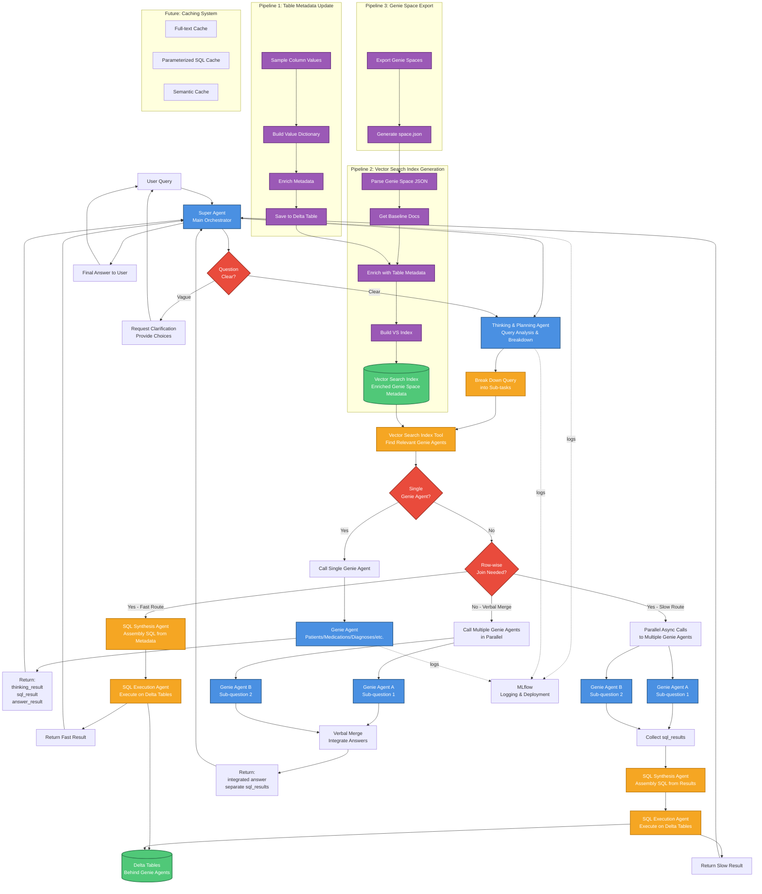

# Multi-Agent System Architecture Diagram

This document contains the architecture diagrams for the KUMC POC Multi-Agent System project.

## Overview

The system consists of three main components:
1. **Multi-Agent System** - Main query processing and response system
2. **Vector Search Index Pipeline** - Builds searchable index of Genie space metadata
3. **Table Metadata Update Pipeline** - Enriches table metadata for better search

## Architecture Components

### Main Agents

1. **Super Agent** - Main orchestrator that coordinates all other agents
2. **Thinking & Planning Agent** - Breaks down queries and plans execution strategy
3. **Genie Agents** - Domain-specific agents (Patients, Medications, Diagnoses, etc.)
4. **SQL Synthesis Agent** - Assembles SQL queries from metadata or sub-results
5. **SQL Execution Agent** - Executes SQL queries on Delta tables

### Decision Points

1. **Question Clarity Check** - Determines if user query needs clarification
2. **Single vs Multiple Agent Decision** - Routes to appropriate execution path
3. **Join Requirement Decision** - Determines if row-wise join or verbal merge is needed

### Execution Paths

#### Path 1: Single Genie Agent
- Used when one Genie Agent can completely answer the question
- Direct call to Genie Agent → Return result

#### Path 2: Multiple Agents with Join (Fast Route)
- SQL Synthesis Agent uses metadata directly
- Generates and executes joined SQL query
- Returns result first (fast response)

#### Path 3: Multiple Agents with Join (Slow Route)
- Parallel async calls to multiple Genie Agents
- Collects sql_results from each agent
- SQL Synthesis Agent combines the results
- Returns comprehensive result (more accurate)

#### Path 4: Multiple Agents - Verbal Merge
- No common column needed for join
- Calls multiple agents in parallel
- Verbally integrates answers
- Returns integrated response with separate SQL results

### Supporting Pipelines

#### Pipeline 1: Table Metadata Update (Build First)
```
Sample Column Values → Build Value Dictionary → Enrich Metadata → Save to Delta Table
```

Purpose: Enriches table metadata with column samples and value dictionaries

#### Pipeline 2: Vector Search Index Generation (Build Second)
```
Parse Genie Space JSON → Get Baseline Docs → Enrich with Table Metadata → Build VS Index
```

Purpose: Creates searchable vector index of enriched Genie space metadata

#### Pipeline 3: Genie Space Export (Prerequisite)
```
Export Genie Spaces → Generate space.json
```

Purpose: Exports Genie space configurations for processing

### Data Stores

1. **Vector Search Index** - Databricks managed vector search index containing enriched metadata
2. **Delta Tables** - Underlying data tables behind Genie Agents
3. **Enriched Metadata Table** - Unity Catalog table with enriched parsed docs

### Integration

- **MLflow** - Logging and deployment for all agents
- **LangGraph** - Supervisor-style agent orchestration
- **Databricks ResponsesAgent** - Integration with Databricks Genie

### Future Components (TODO)

1. **Full-text Cache** - Cache complete query-response pairs
2. **Parameterized SQL Cache** - Cache SQL queries with parameters
3. **Semantic Cache** - Cache semantically similar queries

## Query Flow Example

### Example Query: "How many patients older than 50 years are on Voltaren?"

1. **User** → Super Agent
2. **Super Agent** → Thinking & Planning Agent
3. **Thinking & Planning Agent** breaks down:
   - Sub-task 1: Count patients older than 50 years
   - Sub-task 2: Count patients taking Voltaren
   - Requirement: Need to join on patient_id
4. **Vector Search Tool** identifies:
   - Patients Genie Agent (has age information)
   - Medications Genie Agent (has medication information)
5. **Decision**: Multiple agents + Join required
6. **Fast Route** (parallel execution):
   - SQL Synthesis Agent creates joined query using metadata
   - SQL Execution Agent runs on Delta tables
   - Returns count immediately
7. **Slow Route** (parallel execution):
   - Patients Agent: Gets patients > 50 years
   - Medications Agent: Gets patients on Voltaren
   - SQL Synthesis Agent: Joins results on patient_id
   - SQL Execution Agent: Executes final query
   - Returns comprehensive result
8. **Super Agent** → Returns to User

## File Formats

### Available Formats

1. **Mermaid Diagram** (`architecture_diagram.mmd`)
   - Can be rendered in Markdown viewers, GitHub, or Mermaid Live Editor
   - Convert to PNG/SVG/PDF using Mermaid CLI or online tools

2. **PlantUML Diagram** (`architecture_diagram.puml`)
   - Can be rendered using PlantUML tools
   - Convert to PNG/SVG/PDF using PlantUML

3. **CSV Format** (`architecture_nodes_edges.csv`)
   - Two sections: Edges (connections) and Nodes (components)
   - Can be imported into Lucid Chart, Visio, or other diagramming tools

4. **This Documentation** (`ARCHITECTURE_DIAGRAM.md`)
   - Human-readable overview with embedded diagrams

## How to Use These Files

### For Lucid Chart Import

1. **Method 1: Using CSV**
   - Open Lucid Chart
   - Go to File → Import Data → CSV
   - Import `architecture_nodes_edges.csv`
   - Map columns appropriately (Source → Target with Label)

2. **Method 2: Manual Recreation**
   - Use this documentation as reference
   - Create shapes based on Node definitions in CSV
   - Create connections based on Edge definitions in CSV
   - Apply colors from the Type/Color mapping

### For Rendering to PNG/PDF

#### Using Mermaid CLI
```bash
# Install mermaid-cli
npm install -g @mermaid-js/mermaid-cli

# Generate PNG
mmdc -i architecture_diagram.mmd -o architecture_diagram.png -w 3000 -H 2000

# Generate SVG (scalable)
mmdc -i architecture_diagram.mmd -o architecture_diagram.svg

# Generate PDF
mmdc -i architecture_diagram.mmd -o architecture_diagram.pdf
```

#### Using PlantUML
```bash
# Install PlantUML (requires Java)
# Download from https://plantuml.com/download

# Generate PNG
java -jar plantuml.jar architecture_diagram.puml

# Generate SVG
java -jar plantuml.jar -tsvg architecture_diagram.puml

# Generate PDF
java -jar plantuml.jar -tpdf architecture_diagram.puml
```

#### Using Online Tools
- **Mermaid Live Editor**: https://mermaid.live
  - Paste content from `architecture_diagram.mmd`
  - Export as PNG/SVG/PDF
  
- **PlantUML Online**: https://www.plantuml.com/plantuml
  - Paste content from `architecture_diagram.puml`
  - Export as PNG/SVG/PDF

### For Editing

All formats are text-based and can be edited in any text editor:
- Modify nodes, connections, labels
- Adjust colors, styles, layout
- Re-render after changes

## Color Legend

- **Blue (#4A90E2)** - Agents (Super Agent, Thinking Agent, Genie Agents, SQL Agents)
- **Green (#50C878)** - Data Stores (Vector Search Index, Delta Tables)
- **Orange (#F5A623)** - Processes (Search, Synthesis, Merge operations)
- **Red (#E94B3C)** - Decision Points (Clarity check, routing decisions)
- **Purple (#9B59B6)** - Pipeline Components (Table metadata, VS index, exports)
- **Gray (#BDC3C7)** - Future Components (Caching system)
- **Orange (#FFA500)** - Integration (MLflow)

## Mermaid Diagram



## Notes

- All agents are logged via MLflow for tracking and deployment
- The system follows the LangGraph ResponsesAgent pattern from Super_Agent.ipynb
- Build order: Pipeline 3 → Pipeline 1 → Pipeline 2 → Multi-Agent System
- Fast route provides quick responses while slow route ensures accuracy

