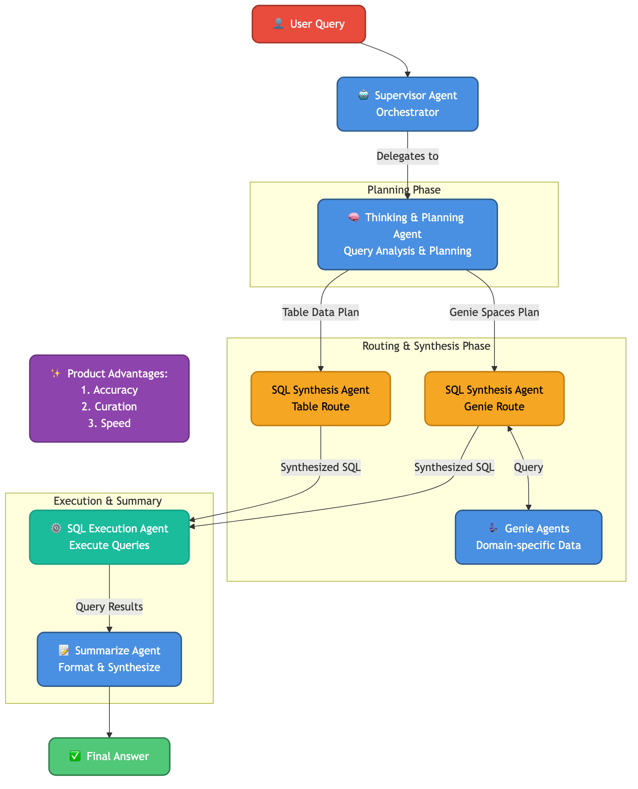

# DBX-UnifiedChat - Databricks Unified Chat

> A multi-agent system for intelligent cross-domain data queries built with LangGraph, Databricks Genie, Lakebase, and Claude models/skills on Databricks Platform.

[](https://www.python.org/downloads/)
[](LICENSE.md)
[](https://github.com/langchain-ai/langgraph)
[](https://github.com/langchain-ai/langchain)
[](https://mlflow.org/)
[](https://github.com/databricks/databricks-sdk-py)
[](https://github.com/pydantic/pydantic)
[](https://www.anthropic.com/claude)
[](https://www.anthropic.com/claude)

---

## Overview

Organizations struggle to query data across multiple domains and data sources, requiring deep SQL expertise and knowledge of complex data schemas. **Databricks Unified Chat** solves this by providing an intelligent multi-agent system that routes natural language queries to the appropriate data sources, synthesizes results, and delivers comprehensive answers.

Built on LangGraph, Databricks Genie and Lakebase, this solution enables business users to ask questions spanning multiple data domains without needing to understand the underlying data architecture or write complex SQL queries.

> ### Why use DBX-UnifiedChat?
- **Accuracy of Answer** 
    - Validated with customers and partners, e.g., tumor outcome data analysis.
- **Explanation and Curation** 
    - Results are curated and explained by SQL answer returned and associated explanations.
- **Speed**
    - Optimized with parallel/cache/token reduction/architecture design
    - Achieves 1-2 seconds TTFT
    - For complex query across domains, we see it achieves 1/3 to 1/2 of the time of the No/Low-Code custom agent solution.


## Architecture



The system uses a multi-agent architecture powered by LangGraph:

* **Supervisor Agent (multi-purpose)** - Frontend agent that orchestrates the workflow and coordinates handoffs to other agents
* **Thinking & Planning Agent** - Analyzes queries and creates execution plans based on the query intent and context
* **Genie Agents** - Query individual Genie spaces for domain-specific data
* **SQL Synthesis Agent (table route)** - Combines and synthesizes SQL across table data sources using UC Functions (instructed retrieval)
* **SQL Synthesis Agent (genie route)** - Combines and synthesizes SQL across genie space data sources using Genie agents as tools (parallel execution)
* **SQL Execution Agent** - Executes queries and extracts results
* **Summarize Agent** - Summarizes results and formats responses for the user

The system leverages:
* **LangGraph** for agent orchestration and workflow management
* **LangChain** for agent tools and integrations
* **Lakebase** for state management and long/short-term memory
* **Databricks Genie** as Agent/Tool for natural language to SQL conversion
* **UC Functions** as Tools for multi-step instructed retrieval
* **Databricks SDK** for Databricks platform integration
* **Databricks SQL Warehouse** for query execution
* **Model Serving** for model deployment and serving
* **MLflow** for Agent observability, evaluation and model tracking
* **Pydantic** for data validation and configuration
* **Pytest** for testing framework
* **PyYAML** for configuration management
* **Vector Search** for semantic metadata retrieval
* **Unity Catalog** for data governance and metadata management

### Key Technologies Applied:

* **Multi-turn Chatting** - Supports clarification, continue, refine, and new question flows for conversational interactions
* **Meta-question Fast Route** - Optimized path for handling meta-questions about the system itself
* **Multi-step Instructed Retrieval** - Advanced retrieval strategy in table route with step-by-step instructions
* **Parallel GenieAgent Tool Calls** - Concurrent execution of multiple Genie agents for improved performance in Genie route
* **Lakebase with Long/Short-term Memory** - Persistent memory management for maintaining context across conversations

See [Architecture Documentation](docs/ARCHITECTURE.md) for detailed design.

---

## Quick Start

### Prerequisites

* Python 3.10 or higher
* Databricks workspace with:
  * Genie spaces configured
  * Vector Search index for metadata
  * SQL Warehouse or Compute cluster
* Databricks CLI configured

### Installation

Please see the [**Development Guide**](docs/DEVELOPMENT_GUIDE.md) for detailed instructions on the three supported workflows:
1. **Local Development**: Fastest iteration for unit tests and logic changes.
2. **Databricks Notebook Dev**: Integration testing with real services.
3. **Production Deployment (CI/CD)**: Final deployment to Model Serving endpoints.

```bash
# Quick clone
git clone https://github.com/databricks-solutions/dbx-unifiedchat.git
cd dbx-unifiedchat

# See docs/DEVELOPMENT_GUIDE.md for next steps
```

### Configuration

Set up your environment variables in `.env`:

```bash
DATABRICKS_HOST=https://your-workspace.cloud.databricks.com
DATABRICKS_TOKEN=your-token

# Genie Configuration
GENIE_SPACE_IDS=space_id_1,space_id_2

# Vector Search Configuration
VECTOR_SEARCH_ENDPOINT=your-endpoint
VECTOR_SEARCH_INDEX=catalog.schema.index_name

# SQL Configuration
SQL_WAREHOUSE_ID=your-warehouse-id
```

### Run Locally

```bash
# Test the agent with a sample query
python -m src.multi_agent.main --query "Show me patient demographics by region"
```

### Deploy to Databricks

1. **Prepare your data** (First time only):
   ```bash
   cd etl/
   python local_dev_etl.py --all --sample-size 10
   ```

2. **Test in Databricks notebook**:
   * Open `notebooks/test_agent_databricks.py` in your Databricks workspace
   * Run cells to test with real services

3. **Deploy to Model Serving**:
   * Open `notebooks/deploy_agent.py` in your Databricks workspace
   * Follow deployment instructions to create a serving endpoint

See [Deployment Guide](docs/DEPLOYMENT.md) for complete instructions.

---

## Repository Structure

```
.
├── etl/                      # ETL pipeline for metadata enrichment
│   ├── local_dev_etl.py     # Local ETL testing script
│   └── *.py                 # ETL notebooks for Databricks
├── src/multi_agent/          # Core agent system
│   ├── agents/              # Agent implementations
│   ├── core/                # Graph, state, and configuration
│   ├── tools/               # Agent tools and utilities
│   └── main.py              # Entry point for local execution
├── notebooks/                # Databricks notebooks
│   ├── test_agent_databricks.py   # Testing notebook
│   └── deploy_agent.py      # Deployment notebook
├── tests/                    # Test suite
│   ├── unit/                # Unit tests
│   ├── integration/         # Integration tests
│   └── e2e/                 # End-to-end tests
├── docs/                     # Documentation
│   ├── ARCHITECTURE.md      # System architecture
│   ├── DEPLOYMENT.md        # Deployment guide
│   ├── LOCAL_DEVELOPMENT.md # Local development guide
│   └── CONFIGURATION.md     # Configuration reference
├── config/                   # Configuration files
├── dev_config.yaml          # Development configuration
├── prod_config.yaml         # Production configuration
└── pyproject.toml           # Python package configuration
```

---

## Documentation

### Getting Started

* [**Development Guide**](docs/DEVELOPMENT_GUIDE.md) - Comprehensive guide for local, notebook, and CI/CD development workflows
* [**Local Development Guide**](docs/LOCAL_DEVELOPMENT.md) - Set up your local development environment
* [**ETL Pipeline Guide**](etl/README.md) - Prepare metadata for the agent system
* [**Configuration Reference**](docs/CONFIGURATION.md) - Configure for different environments
* [**Deployment Guide**](docs/DEPLOYMENT.md) - Deploy to Databricks Model Serving

### Reference

* [**Architecture**](docs/ARCHITECTURE.md) - System design and agent workflows
* [**API Reference**](docs/API.md) - Agent APIs and interfaces
* [**Testing Guide**](tests/README.md) - Run tests and write new tests
* [**Contributing**](CONTRIBUTING.md) - Contribution guidelines

---

## Testing

```bash
# Run all tests
pytest

# Run specific test suites
pytest tests/unit/              # Fast unit tests
pytest tests/integration/        # Integration tests with Databricks
pytest tests/e2e/               # End-to-end system tests

# Run with coverage
pytest --cov=src.multi_agent tests/
```

See [Testing Guide](tests/README.md) for detailed testing documentation.

---

## Configuration

This repository supports three configuration modes:

| Configuration | Environment | Purpose |
|--------------|-------------|---------|
| `.env` + `config.py` | Local development | Fast iteration with local Python |
| `dev_config.yaml` | Databricks notebooks | Testing with real Databricks services |
| `prod_config.yaml` | Model Serving | Production deployment configuration |

All three configurations use the same agent code from `src/multi_agent/`.

See [Configuration Guide](docs/CONFIGURATION.md) for details.

---

## Examples

### Query Examples

```python
from src.multi_agent.main import run_agent

# Simple query
result = run_agent("What are the top 10 customers by revenue?")

# Cross-domain query
result = run_agent("Show me patient outcomes correlated with treatment protocols")

# Complex analytical query
result = run_agent("Compare sales performance across regions for the last quarter")
```

### Deployment Example

```python
# Deploy to Databricks Model Serving
from databricks import agents

# Register agent as MLflow model
agents.deploy(
    model_name="dbx-unifiedchat-agent",
    model_version=1,
    endpoint_name="unified-chat-endpoint"
)
```

---

## What's Included

| Component | Description |
|-----------|-------------|
| **Multi-Agent System** | LangGraph-based agent orchestration with specialized agents |
| **Genie Integration** | Native integration with Databricks Genie spaces |
| **Vector Search** | Semantic routing and metadata retrieval |
| **ETL Pipeline** | Metadata enrichment and index building |
| **Deployment Tools** | Notebooks and scripts for Databricks deployment |
| **Test Suite** | Comprehensive unit, integration, and E2E tests |

---

## Contributing

We welcome contributions! Please see [CONTRIBUTING.md](CONTRIBUTING.md) for:

* Development setup and workflow
* Code style guidelines and testing requirements
* Pull request process
* Community guidelines

For security vulnerabilities, please see our [Security Policy](SECURITY.md).

---

## Support Disclaimer

The content provided here is for **reference and educational purposes only**. It is not officially supported by Databricks under any Service Level Agreements (SLAs). All materials are provided **AS IS**, without any guarantees or warranties, and are not intended for production use without proper review and testing.

The source code in this project is provided under the Databricks License. All third-party libraries included or referenced are subject to their respective licenses. See [NOTICE.md](NOTICE.md) for third-party license information.

If you encounter issues while using this content, please open a GitHub Issue in this repository. Issues will be reviewed as time permits, but there are **no formal SLAs** for support.

---

## License

(c) 2026 Databricks, Inc. All rights reserved.

The source in this project is provided subject to the Databricks License. See [LICENSE.md](LICENSE.md) for details.

**Third-Party Licenses**: This project depends on various third-party packages. See [NOTICE.md](NOTICE.md) for complete attribution and license information.

---

## Acknowledgments

Built with:

* [**LangGraph**](https://github.com/langchain-ai/langgraph) - Agent orchestration and workflow management
* [**Databricks Genie**](https://docs.databricks.com/genie/) - Natural language to SQL conversion
* [**Databricks Vector Search**](https://docs.databricks.com/vector-search/) - Semantic search and retrieval
* [**MLflow**](https://mlflow.org/) - Model deployment and serving
* [**Unity Catalog**](https://docs.databricks.com/data-governance/unity-catalog/) - Data governance and metadata

---

## About Databricks Field Solutions

This repository is part of the [Databricks Field Solutions](https://github.com/databricks-solutions) collection - a curated set of real-world implementations, demonstrations, and technical content created by Databricks field engineers to share practical expertise and best practices.
