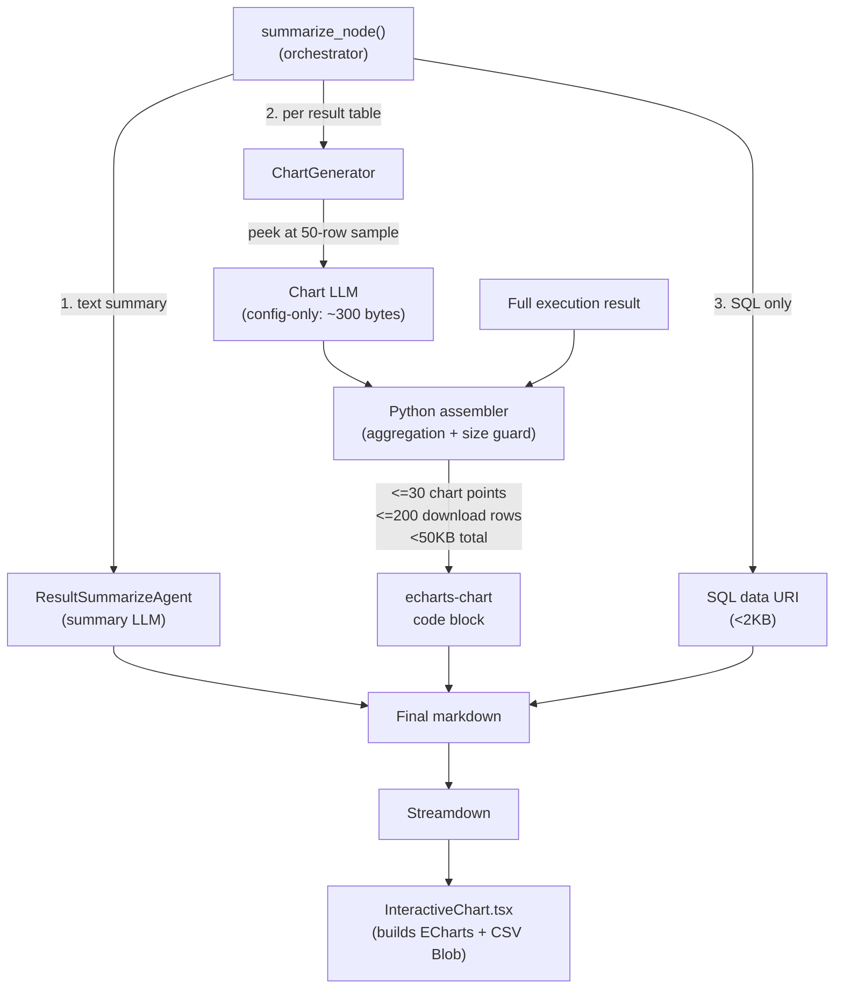

# Clean Streaming Output with Collapsible Steps, Downloads, and Interactive Charts

## Problem

Currently, all intermediate workflow events (intent analysis, planning, SQL synthesis, execution progress, routing decisions) are emitted as flat text items with emoji prefixes, producing a messy log-style output in the chat UI. The user wants:

1. Intermediate steps (thinking, tool calls) in a collapsible/expandable section
2. SQL in a "Show SQL" expandable button, downloadable
3. Full results downloadable as CSV
4. Final summary as clean, well-formatted markdown
5. Interactive plots below each result table (when plottable), with chart type switching and reset

## Architecture




**Key design principles:**

- LLM decides WHAT to visualize (config), Python provides REAL DATA, frontend RENDERS
- CSV download is a frontend button (Blob URL on click), NOT a data URI in the HTML
- All embedded JSON stays under 50KB via size guard
- Chart always renders <=30 data points for fast rendering

---

## Performance Safeguards


| Concern                     | Safeguard                                         | Max Size                  |
| --------------------------- | ------------------------------------------------- | ------------------------- |
| Chart rendering speed       | Always <=30 aggregated data points                | ~3KB JSON                 |
| Download data in code block | <=200 rows embedded for CSV generation            | ~25KB JSON                |
| Total code block size       | Python size guard before embedding                | <50KB                     |
| CSV download                | Frontend Blob URL on click (NOT data URI in HTML) | Zero DOM cost until click |
| SQL download                | Data URI (SQL is always small)                    | <2KB                      |
| Streamdown parsing          | No large data URIs, chart block is <50KB          | Fast re-parse on stream   |
| Message storage             | Entire chart block <50KB per result set           | DB-friendly               |


---

## Desired Output Structure

```text
<details>
<summary>Processing Steps</summary>
- Analyzed intent: new_question (92% confidence)
- Created plan: table_route strategy for 2 spaces
- Generated SQL query
- Executed query: 7 rows, 5 columns
</details>

## Claims Financial Analysis by Benefit and Pay Type

[Clean LLM narrative summary]

### Results

| Benefit Type | Pay Type | Total Paid Amount | ... |
| ... | ... | $5,969,134.05 | ... |

[Interactive ECharts chart + Download CSV button rendered here]

### Key Insights
[LLM insights]

---

<details><summary>Show SQL</summary>
SELECT e.benefit_type, ...
<a href="data:text/sql;..." download="query.sql">Download SQL</a>
</details>
```

Note: CSV download is on the chart component, NOT a link in the markdown.

---

## Part A: Backend Changes (Python)

### 1. `[src/multi_agent/core/responses_agent.py](src/multi_agent/core/responses_agent.py)` - Filter streaming events

In `predict_stream()` (line ~532 onward):

- Add state tracking: `current_node`, `progress_steps`, `details_emitted`
- `**custom` events** (line ~639): Collect into `progress_steps`, only yield `meta_answer_content`, `clarification_content`, and error events directly
- `**updates` events** (line ~558): Stop yielding step indicators / routing decisions. Add to `progress_steps`. Still process AIMessage content.
- `**messages` events** (line ~537): Only yield LLM token deltas when `current_node == "summarize"`
- `**tasks` events** (line ~654): Track `current_node`. When `summarize` starts, emit collapsible `<details>` block with collected progress, then close it.

### 2. `[src/multi_agent/agents/summarize_agent.py](src/multi_agent/agents/summarize_agent.py)` - Restructure summary output

`**_build_summary_prompt()` (line 170):**

- LLM should NOT include SQL or workflow sections
- Focus on: title, narrative, well-formatted results table ($X,XXX,XXX.XX), key insights

`**generate_summary()` (line 65):**

- Just return clean LLM summary. Chart + downloads handled by `summarize_node()`.
- Remove `_format_option_b_tables()` calls (lines 96-108)

**New `_format_sql_download()`** (replaces old download methods):

- Only handles SQL (collapsible `<details>` + small data URI)
- CSV download is now on the frontend chart component

### 2b. NEW: `[src/multi_agent/agents/chart_generator.py](src/multi_agent/agents/chart_generator.py)` - ChartGenerator class

**Three-stage pipeline: LLM config -> Python assembly -> size-guarded output**

**Stage 1: LLM generates config only (~300 bytes)**

The LLM receives a 50-row sample + column names + original query + total row count. Outputs:

```
{
  "plottable": true,
  "chartType": "bar",
  "title": "Total Paid Amount and Copay by Benefit and Pay Type",
  "xAxisField": "benefit_type",
  "groupByField": "pay_type",
  "series": [
    {"field": "total_paid_amount", "name": "Total Paid Amount", "format": "currency"},
    {"field": "total_copay_coinsurance", "name": "Copay/Coinsurance", "format": "currency"}
  ],
  "sortBy": {"field": "total_paid_amount", "order": "desc"},
  "aggregation": null
}
```

**Plottability rules:**

- `{"plottable": false}` ONLY for fundamentally non-visual data (single scalar, all-text, no numeric dimension)
- High row count is NEVER a reason to skip -- LLM must specify aggregation for large data

**Aggregation strategies** (for 100+ rows):

- `{"type": "topN", "n": 20, "metric": "total_paid_amount", "otherLabel": "Other"}`
- `{"type": "timeBucket", "field": "date_service", "bucket": "month", "metric": "paid_amount", "function": "sum"}`
- `{"type": "histogram", "field": "paid_amount", "bins": 15}`
- `{"type": "frequency", "field": "diagnosis_code", "topN": 20}`
- `null` for small datasets

**Stage 2: Python assembles real data with limits**

`_assemble_data(columns, full_data, config)`:

1. Apply aggregation strategy (if specified) using exact Python arithmetic
2. **Chart data**: always <=30 data points (for chart rendering)
3. **Download data**: up to 200 rows of the original data (for CSV download on frontend)
4. Both use REAL values from execution results -- no LLM hallucination

**Stage 3: Size guard before output**

Before returning the final JSON:

- Serialize to JSON string
- If > 50KB: reduce `downloadData` rows until under 50KB
- If still > 50KB: drop `downloadData` entirely (chart still works, CSV unavailable)
- Log a warning if truncation occurs

**Final output format** (what goes into the `echarts-chart` code block):

```
{
  "config": {
    "chartType": "bar",
    "title": "...",
    "xAxisField": "benefit_type",
    "groupByField": "pay_type",
    "series": [
      {"field": "total_paid_amount", "name": "Total Paid Amount", "format": "currency"},
      {"field": "total_copay_coinsurance", "name": "Copay/Coinsurance", "format": "currency"}
    ],
    "toolbox": true
  },
  "chartData": [
    {"benefit_type": "MEDICAL", "pay_type": "COMMERCIAL", "total_paid_amount": 5969134.05, "total_copay_coinsurance": 331816.44},
    ...up to 30 aggregated rows for chart rendering...
  ],
  "downloadData": [
    ...up to 200 rows of original data for CSV download...
  ],
  "totalRows": 7,
  "aggregated": false,
  "aggregationNote": null
}
```

For a 500-row result:

```
{
  "config": {
    "chartType": "bar",
    "title": "Top 20 Diagnosis Codes by Claim Count",
    "aggregation": {"type": "topN", "n": 20, ...}
  },
  "chartData": [ ...20 aggregated rows + 1 "Other"... ],
  "downloadData": [ ...first 200 original rows... ],
  "totalRows": 500,
  "aggregated": true,
  "aggregationNote": "Top 20 of 500 diagnosis codes by claim count"
}
```

### 2c. `[src/multi_agent/core/config.py](src/multi_agent/core/config.py)` - Add chart endpoint

Add `chart_endpoint` to `LLMConfig`:

- `chart_endpoint=os.getenv("LLM_ENDPOINT_CHART", d)` in `from_env`
- `chart_endpoint=_mc_get(mc, "llm_endpoint_chart", d)` in `from_model_config`
- Defaults to same LLM, can point to faster/cheaper model

### 3. `[src/multi_agent/agents/summarize.py](src/multi_agent/agents/summarize.py)` - Orchestrate

`**summarize_node()` (line 331):**

1. Call `ResultSummarizeAgent` -> text summary (streams to user)
2. For each result set: call `ChartGenerator.generate_chart()` -> chart JSON or None
3. Insert `echarts-chart` code blocks after results tables in the summary
4. Append `_format_sql_download()` (collapsible SQL with small data URI)
5. Return: `{"final_summary": summary, "messages": [AIMessage(content=summary)]}`
6. Remove pandas DataFrame block (lines 396-434)

---

## Part B: Frontend Changes (React/TypeScript)

### 4. Install ECharts

```
npm install echarts echarts-for-react --workspace=@databricks/chatbot-client
```

### 5. NEW: `[agent_app/e2e-chatbot-app-next/client/src/components/elements/interactive-chart.tsx](agent_app/e2e-chatbot-app-next/client/src/components/elements/interactive-chart.tsx)`

Receives `config` + `chartData` + `downloadData` from the code block. Builds ECharts option at render time.

`**buildEChartsOption(spec)` function:**

1. Extract x-axis values from `chartData` using `config.xAxisField`
2. If `groupByField`: pivot data into multi-series
3. Map each `config.series[].field` to ECharts series with real values
4. Apply formatters: `"currency"` -> tooltip `$1,234,567.89`, axis `$1.2M`; `"percent"` -> `%`
5. Add toolbox (magicType, restore, saveAsImage, dataView)
6. Return complete ECharts option

**UI controls:**

- **Chart type buttons**: Bar, Line, Scatter, Pie (overrides all series types)
- **Reset button**: restores to LLM's original `config.chartType` + ECharts `restore` action
- **Download CSV button**: on click, generates CSV from `downloadData` (or `chartData` if no downloadData), creates `URL.createObjectURL(new Blob([csv], {type: 'text/csv'}))`, triggers download
- **Aggregation note**: if `aggregated: true`, shows "Showing top 20 of 500 rows -- full data available in CSV" (or "CSV contains first 200 of 500 rows" if truncated)

**Why Blob URL instead of data URI?**

- Zero DOM/memory cost until user clicks Download
- No huge string embedded in HTML for Streamdown to parse
- No browser data URI size limits
- Blob is created and revoked on demand

**Component sizing:**

- Full-width, 400px height, SVG renderer
- Responsive to container width
- Chart type buttons + Reset + Download CSV in a toolbar above the chart

### 6. Update `[agent_app/e2e-chatbot-app-next/client/src/components/elements/response.tsx](agent_app/e2e-chatbot-app-next/client/src/components/elements/response.tsx)`

Override Streamdown `code` component:

- Check `className === 'language-echarts-chart'`
- Parse JSON, render `<InteractiveChart spec={parsed} />`
- On parse failure: fall back to regular code block
- Register alongside existing citation integration in `components` prop

---

## Edge Cases

- **Clarification/meta-question flows**: yielded directly, not hidden in progress
- **Error flows**: error events yielded as visible text
- **Non-plottable**: LLM returns `{"plottable": false}` only for non-visual data. No chart inserted. Table + CSV still available via a simple download link in the markdown (small data URI, capped at 50 rows).
- **Malformed chart config**: `generate_chart()` returns `None`, chart skipped silently
- **Large data (100+ rows)**: LLM specifies aggregation, Python executes it. Chart shows <=30 points. Download data capped at 200 rows.
- **Size guard triggered**: if JSON > 50KB, `downloadData` is trimmed. If still > 50KB, `downloadData` dropped (chart still renders from `chartData`)
- **Chart LLM latency**: ~1-2s per chart, runs after summary streams
- **Multiple result sets**: each gets its own chart block (<50KB each)
- **Frontend parse failure**: falls back to regular code block
- **Unknown aggregation type**: Python falls back to topN=20 by first numeric column
- **No chart + small result (<=50 rows without chart)**: include a simple CSV download link as a small data URI in the markdown (fallback for non-plottable results)

