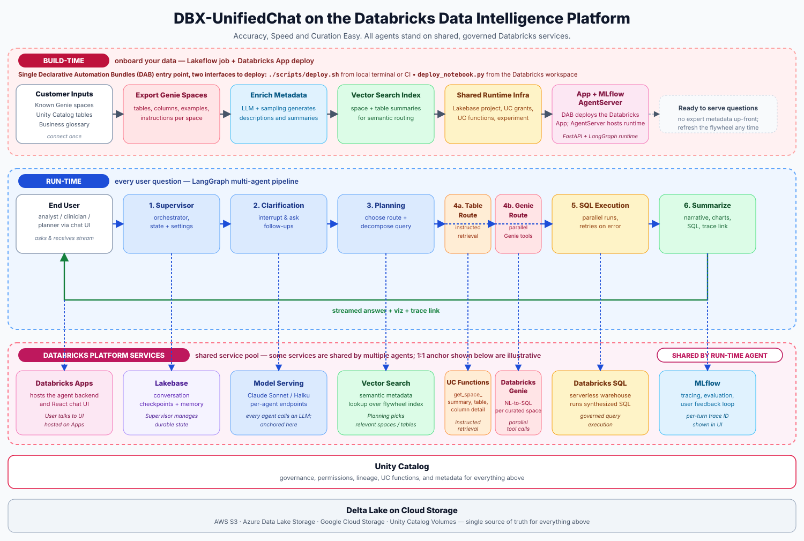

# DBX-UnifiedChat: A field-built, code-first multi-agent NL-to-SQL solution for cross-domain analytics

**An open-source Databricks App that combines Genie, Vector Search, Lakebase, and LangGraph to answer complex questions spanning multiple data domains—with explainable SQL, fast first response, and production-grade observability.**

---

## Summary

- **Production-ready NL-to-SQL chat on Databricks.** DBX-UnifiedChat is an open-source [Databricks App](https://docs.databricks.com/dev-tools/databricks-apps/) and multi-agent runtime that uses Genie, Vector Search, Lakebase, MLflow, DBSQL, Unity Catalog Functions, Model Serving, and Databricks Asset Bundles to turn natural language into governed, executable SQL.
- **Field-validated on real clinical analytics.** At the University of Kansas Medical Center (KUMC), the team exercised the solution on the C3OD tumor-outcome use case over several months of iterative field validation. In that setting, reviewers observed answer accuracy above 85% on curated evaluation questions—not a universal benchmark, but a sustained result on a demanding cross-domain workload.
- **Built for speed on complex questions.** Through planning-driven routing, parallel Genie execution, metadata caching, pre-warm, and multithreaded agent orchestration, the field team observed roughly 1–2 second time-to-first-token on typical turns and completion times for complex cross-domain queries that were often one-third to one-half of what they saw with no/low-code custom agent alternatives in the same environment.

---

## Why cross-domain NL-to-SQL is hard

Most natural-language analytics tools work well when a question maps cleanly to a single Genie space or a handful of related tables. Real enterprise questions rarely stop there. A clinician or analyst might need tumor outcomes from one domain, enrollment criteria from another, and lab values from a third—then ask for a comparison that only makes sense once those pieces are joined correctly.

That complexity shows up in three ways:

1. **Routing** — The system must decide which domains matter, whether to use table metadata or Genie spaces, and how to decompose the question.
2. **Retrieval** — Schema context is large; pulling the wrong columns or missing join keys produces confident but wrong SQL.
3. **Execution and trust** — Users need the SQL, an explanation, and a way to validate before acting on an answer.

Genie, OneChat, and Agent Bricks each address parts of this story. DBX-UnifiedChat is a code-first, field-engineered pattern that composes those platform capabilities with explicit planning, dual synthesis routes, and an opinionated validation UI—similar in spirit to other field-built agent systems such as [MemEx](https://www.databricks.com/blog/memex-programmable-scratchpad-llm-agents), [AiChemy](https://www.databricks.com/blog/aichemy-next-generation-agent-mcp-skills-and-custom-data-drug-discovery), and the [multi-agent audience intelligence](https://www.databricks.com/blog/multi-agent-approach-audience-intelligence) approach, but tuned for governed cross-domain SQL on the Lakehouse.

---

## What is DBX-UnifiedChat?

[DBX-UnifiedChat](https://github.com/databricks-solutions/dbx-unifiedchat) is an open-source reference implementation from Databricks Field Solutions. It packages a LangGraph multi-agent backend, a Next.js chat UI, and a Databricks Asset Bundle so teams can deploy a full NL-to-SQL application—not just a notebook prototype.

Where it fits on the platform:

| Approach | Best for | DBX-UnifiedChat difference |
|----------|----------|----------------------------|
| **Genie spaces** | Domain-scoped self-serve analytics | Orchestrates multiple spaces and table routes in one conversation |
| **OneChat** | Unified chat across Databricks | Adds explicit planning, dual SQL synthesis paths, and validation UX |
| **Agent Bricks MAS** | Composable multi-agent apps with low code | Offers a code-first, extensible agent graph for teams that need custom routing and retrieval |
| **Custom agents** | Fully bespoke workflows | Provides an accelerator with ETL, Vector Search index build, Lakebase state, and MLflow tracing already wired |

The supported deployment surface lives under `agent_app/`: one bundle deploys the app, metadata prep jobs, shared Lakebase infrastructure, and validation workflows.

---

## Architecture at a glance

The runtime follows a simple path: user question → Databricks App UI → MLflow AgentServer → LangGraph orchestration → Databricks services → streamed answer with SQL artifacts.


*Figure 1. High-level architecture: a supervisor coordinates planning, dual SQL synthesis routes, execution, and summarization over Databricks platform services.*

Specialized agents handle distinct responsibilities:

- **Supervisor** — Front-door orchestration and handoffs
- **Thinking & planning** — Query analysis, clarification, and execution plans
- **SQL synthesis (table route)** — Cross-table SQL via Unity Catalog Functions and Vector Search metadata
- **SQL synthesis (Genie route)** — Parallel Genie space queries with merged results
- **SQL execution** — Warehouse execution and result extraction
- **Summarize** — Streaming natural-language answers plus structured table/chart outputs



*Figure 2. DBX-UnifiedChat on the Databricks Data Intelligence Platform. **Build-time** (top): a single DAB entry point — `./scripts/deploy.sh` from local terminal or CI, or `deploy_notebook.py` from the workspace web terminal — runs the metadata flywheel and deploys the App + MLflow AgentServer. **Run-time** (middle): every user question flows through the LangGraph multi-agent pipeline. **Shared platform services** (bottom): runtime agents call into a shared service pool (some 1:1, some called by multiple agents), all governed by Unity Catalog and grounded in Delta Lake on cloud storage.*

Lakebase stores short- and long-term conversation state. MLflow captures traces for every turn, linking UI feedback back to experiments for continuous improvement.

---

## Three techniques that move the needle

### 1. Planning-driven route selection

Before any SQL is generated, a planning agent inspects the question, conversation history, and available domains. It emits an execution plan that selects either the **table route** (metadata-driven SQL synthesis) or the **Genie route** (space-specific NL-to-SQL via Genie agents). Clarification turns are handled in-graph so ambiguous questions do not silently produce bad SQL.

This mirrors patterns seen in other production agent systems: decompose first, then execute with the right tools—rather than asking a single monolithic prompt to do everything.

### 2. Multi-step instructed retrieval on the table route

When the plan selects the table route, the SQL synthesis agent does not dump the entire schema into context. Instead it uses a toolkit of Unity Catalog Functions—`get_space_summary`, `get_table_overview`, `get_column_detail`, and related helpers—to retrieve metadata step by step until it has enough to draft SQL. A reflection pass applies space-specific instructions before finalizing query blocks with explanations.


*Figure 3. Table route: UC Functions retrieve metadata incrementally until the agent can draft, reflect on, and finalize SQL.*

Vector Search backs semantic retrieval over enriched Genie and table documentation, keeping prompts focused and token-efficient.

### 3. Parallel Genie kickoff on the Genie route

For questions that span multiple Genie spaces, the Genie-route synthesis agent builds tools only for relevant spaces, then invokes them in parallel—either through LangGraph tool-calling orchestration or direct `RunnableParallel` execution when the plan is fully specified. Per-space answers merge into a single synthesis result for downstream execution.


*Figure 4. Genie route: planning assigns a per-space sub-question plan, then Genie agents run in parallel before results merge.*

In field testing at KUMC, this parallel kickoff—combined with agent pre-warm on startup and periodic keep-warm against Lakebase—contributed to the observed latency improvements on multi-domain C3OD questions compared with sequential no/low-code agent flows in the same workspace.

---

## Validation, explainability, and traceability

Trustworthy analytics requires more than a fluent summary. Every answer path is designed to expose:

- **Generated SQL** with natural-language explanation
- **Execution results** in a paginated AG Grid table and optional chart workspace
- **Validation accordion** for reviewers to inspect and curate SQL before sharing
- **Thumbs up/down feedback** persisted against MLflow traces
- **One-click trace links** from the UI into the associated MLflow experiment


*Figure 5. Validation loop: SQL, explanation, execution, user feedback, and MLflow traces form a closed observability cycle.*

This closed loop supports the kind of iterative field validation the KUMC team ran on C3OD—where domain experts could review SQL, leave feedback, and trace failures without leaving the app.

---

## User experience built for analysts and reviewers

The chat UI is not an afterthought. It is part of the solution:


*Figure 6. UI experience map: streaming responses, data visualization, validation, feedback, traces, navigation, and agent settings.*

- **Thinking and action collapsibles** show intermediate reasoning without cluttering the main answer
- **Streaming summaries** deliver fast time-to-first-token while longer synthesis runs
- **Visualization workspace** renders interactive charts alongside tabular results
- **Shareable threads and turn navigation** support review workflows across teams
- **Agent settings panel** exposes runtime configuration without redeploying code

See the [annotated UI walkthrough](https://github.com/databricks-solutions/dbx-unifiedchat/blob/main/docs/UI/UI_tutorial_annotated.png) in the repository for a visual tour.

---

## Two paths to adoption

### Path 1: Deploy as a Solutions Accelerator

Teams with Genie spaces, a SQL warehouse, and Unity Catalog metadata can deploy DBX-UnifiedChat as a starting point:

```bash
git clone https://github.com/databricks-solutions/dbx-unifiedchat.git
cd dbx-unifiedchat/agent_app
./scripts/deploy.sh --target dev --run-job full --start-app
```

The bundle runs metadata export, enrichment, Vector Search index build, Lakebase bootstrap, and app deployment from a single entry point. Customize Genie space IDs, catalog settings, and LLM endpoints in `databricks.yml`, then iterate locally with hot reload.

### Path 2: Extend into enterprise multi-agent chat

Because the agent graph is code-first LangGraph—not a black-box configuration—teams can add agents, tools, and routes for adjacent use cases: cohort building, metric explanation, operational dashboards, or handoffs to downstream MCP tools. Lakebase checkpoints and MLflow tracing carry forward as you extend the graph.

---

## Getting started and next steps

DBX-UnifiedChat is available now as open source under the Databricks License:

- **Repository:** [github.com/databricks-solutions/dbx-unifiedchat](https://github.com/databricks-solutions/dbx-unifiedchat)
- **Architecture docs:** [docs/ARCHITECTURE.md](https://github.com/databricks-solutions/dbx-unifiedchat/blob/main/docs/ARCHITECTURE.md)
- **Deployment guide:** run `./scripts/deploy.sh` from `agent_app/` or use the workspace-native deploy notebook

If you are evaluating NL-to-SQL for cross-domain analytics, start with a bounded domain pair, wire your Genie spaces and metadata ETL, and use the validation UI plus MLflow traces to build a curated question set—exactly the workflow that produced the KUMC field results described above.

---

## References

- [Instructed Retriever: Unlocking System-Level Reasoning in Search Agents](https://www.databricks.com/blog/instructed-retriever-unlocking-system-level-reasoning-search-agents) — a multi-step instructed retrieval pattern for table route
- [MemEx: A Programmable Scratchpad for LLM Agents](https://www.databricks.com/blog/memex-programmable-scratchpad-llm-agents) — programmable memory and tool orchestration patterns for production agents
- [AiChemy: Next-generation agent with MCP, skills and custom data for drug discovery](https://www.databricks.com/blog/aichemy-next-generation-agent-mcp-skills-and-custom-data-drug-discovery) — composing platform primitives into domain-specific agent systems
- [A multi-agent approach to audience intelligence](https://www.databricks.com/blog/multi-agent-approach-audience-intelligence) — parallel specialist agents coordinated for complex analytic questions
- [DBX-UnifiedChat repository](https://github.com/databricks-solutions/dbx-unifiedchat) — source, deployment bundle, and documentation
